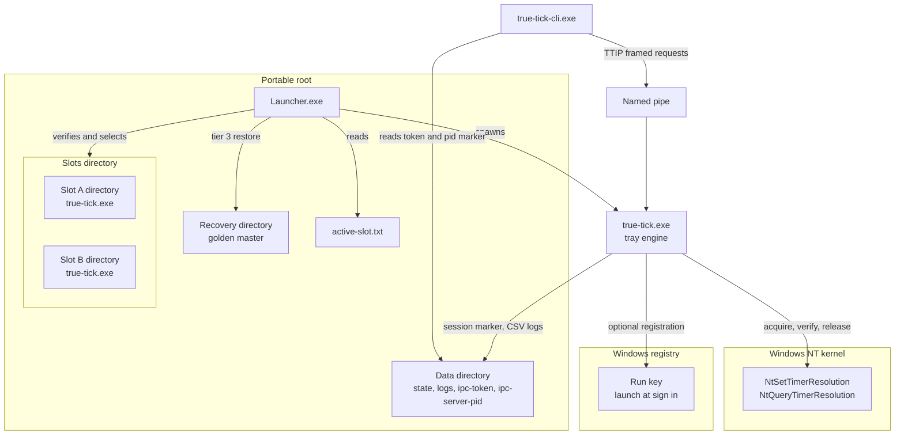
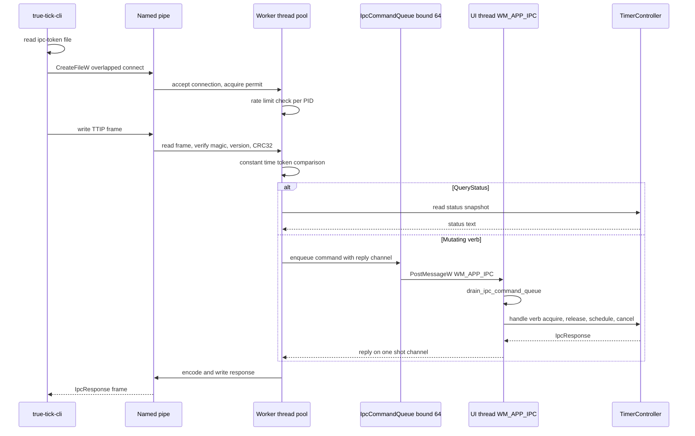
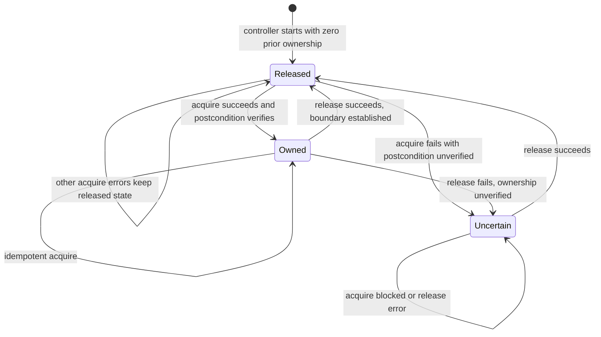
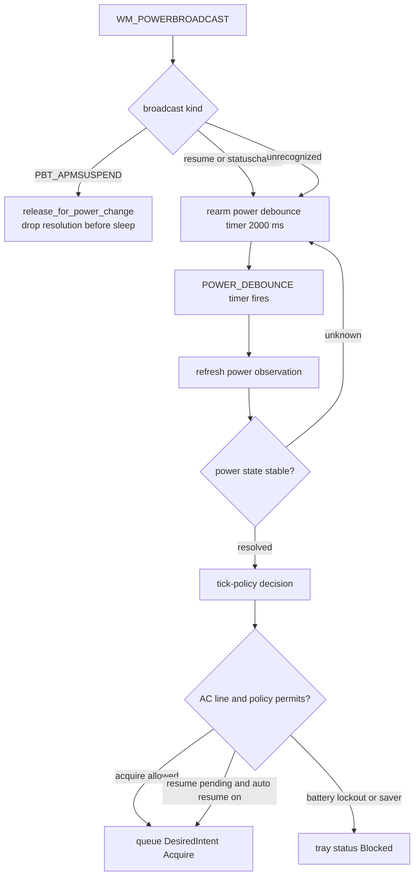
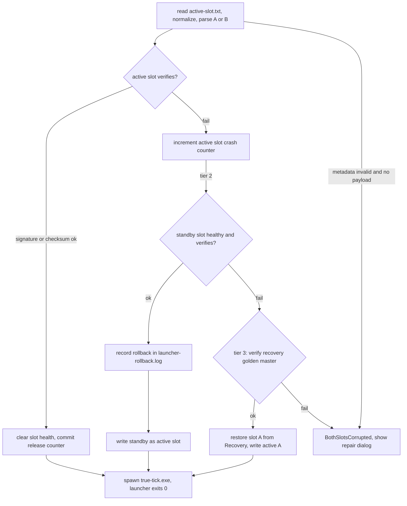

# True Tick Architecture

True Tick is a Windows tray application that manages the process timer resolution through the NT native API. It acquires, verifies, and releases only its own tracked timer resolution request. It does not install drivers, does not modify global system defaults, and does not interfere with external processes.

This document gives a system level view of the runtime architecture. For control flow detail at the individual source file level, see the per file Mermaid diagram set under [`docs/diagrams/`](docs/diagrams/).

## Workspace Layout

| Component | Path | Role |
|-----------|------|------|
| Engine | `apps/true-tick` | Windows tray application, timer lifecycle owner |
| CLI client | `apps/true-tick-cli` | Command line control over named pipe IPC |
| Launcher | `apps/launcher` | A/B slot selection, verification, and recovery |
| Manifest tool | `apps/manifest-tool` | Release manifest signing and verification |
| `tick-core` | `crates/tick-core` | Value types, lifecycle states, time arithmetic |
| `tick-platform-windows` | `crates/tick-platform-windows` | `NtQueryTimerResolution` and `NtSetTimerResolution` bindings |
| `tick-ownership` | `crates/tick-ownership` | Ownership state machine and kernel settle probe |
| `tick-observation-windows` | `crates/tick-observation-windows` | Timer and power observation on Windows |
| `tick-policy` | `crates/tick-policy` | Power policy decisions |
| `tick-ipc` | `crates/tick-ipc` | Wire protocol, frame codec, client transport |
| `tick-diagnostics` | `crates/tick-diagnostics` | CSV logging, privacy scanning, snapshot recorder |
| `tick-watchdog` | `crates/tick-watchdog` | Responsiveness monitoring |
| `tick-startup-windows` | `crates/tick-startup-windows` | Registry run key registration |
| `tick-crypto` | `crates/tick-crypto` | Hashing and signature primitives for manifests |
| `tick-multiclient` | `crates/tick-multiclient` | IPC stress test harness |

## System Context

The portable deployment holds two payload slots and a recovery copy under a single root. The launcher is the entry point, the engine is the long running process, and the CLI is a short lived client.

The engine enforces a single instance through a named mutex. A second launch posts a notification to the existing window and exits. Startup registers a panic hook that resets the timer resolution and records a snapshot before delegating to the default hook, plus a console control handler that runs emergency cleanup on close, logoff, and shutdown events.

## IPC Request Path

The engine hosts a dedicated IPC thread that accepts named pipe connections and dispatches them to a bounded worker pool of eight. Mutating commands are forwarded to the UI thread through a bounded queue and a posted window message, so all timer state transitions stay on the message loop thread.

Frames carry a `TTIP` magic, protocol version 1, a 32 byte ephemeral session token, a command verb, a payload capped at 256 bytes, and a CRC32 trailer. The session token is generated at engine start, written to `ipc-token` in the state directory, and retracted on shutdown. The client verifies the serving process ID against the `ipc-server-pid` marker before trusting a live pipe.

## Timer Lifecycle

Ownership of the timer resolution request is modeled as a three state machine. Only explicit, verified transitions are recorded.

Acquisition resolves the requested interval against the hardware bounds reported by `NtQueryTimerResolution`, preflights it, calls `NtSetTimerResolution` with set true, then samples the effective resolution up to three times and takes the median. If the reported value exceeds the requested value beyond the 100 HNS tolerance, the request is rolled back with set false and the error is surfaced as postcondition unverified. Release issues set false and clears tracking only on success.

After release, a bounded settle probe detects whether the kernel resolution coarsens. When a query after a restorative set false call reports a higher effective value than before, an orphaned token was dropped and the machine has settled. When it does not, an external client still holds the resolution, which is reported rather than corrected. The probe runs at most three attempts and only while ownership is released.

## Power Lifecycle

Power events arrive as `WM_POWERBROADCAST` messages. Suspend releases the timer resolution before sleep. Resume and status change events are debounced through a dedicated window timer before reconciliation, because a single broadcast does not guarantee a stable power reading.

When `automatic` mode is enabled, the policy layer decides whether acquisition is allowed on each power transition. Battery lockout and battery saver can block acquisition outright. When `auto_resume_on_ac` is enabled, returning to AC power reacquires a resolution that was previously released by a manual stop or a battery transition. While a `Pause` action is active, acquisition is suppressed regardless of power state.

## Portable Packaging and Rollback

The launcher implements a three tier boot path. Slot selection reads `active-slot.txt`, verifies the chosen slot, and falls back through progressively stronger recovery tiers.

Verification prefers the signed path when `manifest.sig` is present, loading the trust anchor and verifying manifest, slot, and recovery digests. Otherwise it falls back to matching the executable hash against `SHA256SUMS.txt`. A monotonic release counter rejects downgrade manifests below the persisted value and commits only after a slot is verified for launch.

Per slot crash loop counters live under `Data/state/`. A slot reaching three failures raises `CrashLoopDetected`. Tier 2 promotes the standby slot. Tier 3 restores slot A from the golden master when both slots fail. After selection the launcher spawns the engine with forwarded arguments and returns without waiting for the child.

## Diagnostics and Shutdown

The engine writes daily CSV logs under `Data/logs/` with formula injection neutralization, truncation to 256 bytes per field, and a serialized append lock. Session state is tracked through a binary tombstone marker that distinguishes clean exits from unclean shutdowns, corrupted markers, and unreadable state on the next launch.

Shutdown drains the IPC command queue, stops the server and watchdog, releases ownership, verifies the release settled within a bounded pump window of 50 ms, removes the tray icon, destroys windows, marks the session clean, and flushes logs. Window procedure panics are caught per dispatch and counted rather than allowed to abort the message loop.
