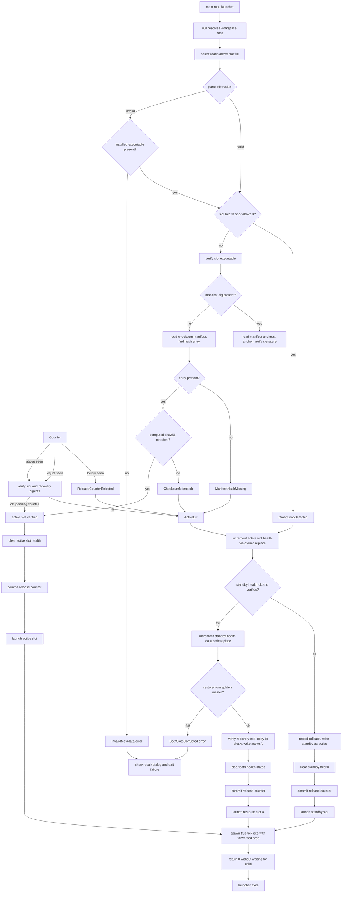

# True Tick Launcher main Control Flow Diagram

Source path: `true-tick/apps/launcher/src/main.rs`

## Notes

- Slot selection reads `active-slot.txt`, normalizes a UTF-8 BOM, CRLF, whitespace and null bytes, then parses `A` or `B`, with a fallback to the first installed executable when the value is invalid.
- Verification uses the signed path when `manifest.sig` is present, otherwise it falls back to the `SHA256SUMS.txt` checksum path.
- The checksum path requires the manifest to exist and to carry a hash entry for the target executable, otherwise `ManifestMissing` or `ManifestHashMissing` is returned.
- The signed path loads the trust anchor, verifies the manifest signature, and verifies both the slot and recovery entry digests.
- Release counter ordering is three way, a manifest counter below the persisted value is rejected as a downgrade, an equal counter is accepted without rewriting the state file, and a greater counter yields a pending value.
- The pending release counter is committed only after a verified slot is committed for launch, so a failed selection or commit cannot advance the counter past the last bootable release.
- Crash-loop health tracking stores a per slot counter under `Data/state/slot-N-health.state`, with a threshold of three before `CrashLoopDetected` is raised. The counter increments with `saturating_add` and is persisted through `atomic_replace` staging plus replace rather than a plain write.
- A successful active slot launch clears its health state, while any failure increments the active slot and moves to the standby slot, which is the Tier 2 rollback.
- Tier 2 rollback records the decision in `Data/logs/launcher-rollback.log`, writes the standby as the active slot, clears standby health, and commits the counter.
- Tier 3 runs when both slots fail, restoring slot A from the golden master under `Recovery`, which must itself pass the `SHA256SUMS.txt` hash requirement, then clears both health states.
- After selection the launcher spawns `true-tick.exe` with the original arguments minus the launcher program name and returns 0 without waiting for the child to exit.
- `main` maps selection or spawn errors to a Windows message box plus a failure exit code, while a successful spawn exits with code 0.