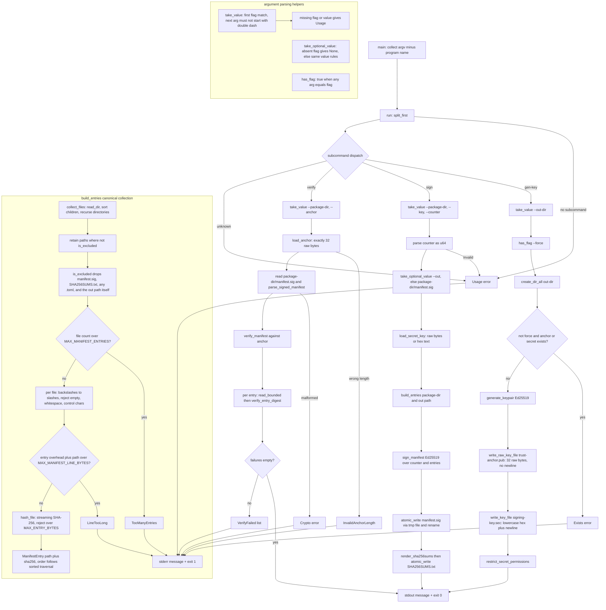

# manifest-tool main.rs

Source: `true-tick/apps/manifest-tool/src/main.rs`

## Notes

- Single binary with three subcommands dispatched by `run`, namely `gen-key`, `sign`, and `verify`, plus an unknown subcommand usage error.
- `gen-key` requires `--out-dir`, accepts `--force`, and refuses to overwrite an existing `trust-anchor.pub` or `signing-key.sec` without it.
- The trust anchor is written through `write_raw_key_file` as exactly `PUBLIC_KEY_LEN` raw bytes with no encoding and no trailing newline.
- The secret key is written as lowercase hex text plus a single newline, then permissions are restricted through `icacls` on Windows or mode `0o600` on unix.
- `load_key_bytes` accepts either raw key bytes or lowercase hex text, while `load_anchor` accepts only a file of exactly 32 raw bytes and rejects any other length.
- `build_entries` collects files with a recursive `collect_files` walk that sorts each directory's children before recursion, so entry order follows sorted traversal.
- Exclusion covers `manifest.sig`, `SHA256SUMS.txt`, every file whose name ends in `.toml` as mutable runtime configuration, and the resolved output path.
- Entry paths are normalized from backslashes to forward slashes, then validated to reject empty paths and any whitespace or control characters.
- Hashing is a streaming `Sha256` over a 64 KiB buffer, and any file above `MAX_ENTRY_BYTES` of 512 MiB is rejected before reading.
- `sign` loads the secret key, builds canonical entries, signs with the release counter through `sign_manifest`, and writes both `manifest.sig` and a `SHA256SUMS.txt` of `hex  path` lines with two space separators.
- Writes are atomic through `atomic_write`, which writes a sibling `tmp` file keyed by process id then renames over the target, falling back to remove and rename.
- `verify` reads `package-dir/manifest.sig`, checks the manifest signature against the anchor, then rehashes every listed entry and reports a `VerifyFailed` aggregate listing the signature and each mismatching path.
