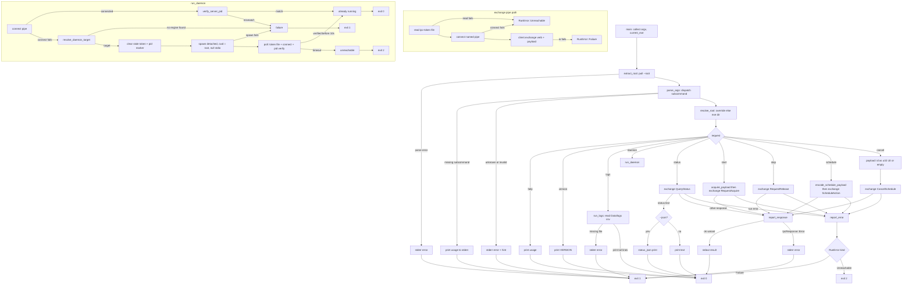

# true-tick-cli main.rs

Source: `true-tick/apps/true-tick-cli/src/main.rs`

## Notes

- Exit codes: 0 success, 1 command/parse/protocol failure, 2 tray unreachable or token unreadable.
- Missing subcommand prints usage to stderr and exits 1.
- `cancel` with no id sends an empty payload, clearing all pending actions, with an id it sends the u32 little endian encoded id.
- `schedule` accepts `start-in`, `stop-in`, `pause` plus a seconds value validated by the shared encoder.
- `logs` reads `Data/logs/true-tick-<date>.csv` directly from disk, never touches the pipe, default tail is 20 lines, missing file exits 1.
- `status --json` converts the space separated `key=value` status text into a JSON object, dropping tokens without `=` or with `unknown` values.
- Daemon path first checks a live pipe, and verifies the serving process PID against the `ipc-server-pid` marker before claiming the daemon is already running.
- Spawn candidates in order: sibling `true-tick.exe`, root `true-tick.exe`, `Slots/A` and `Slots/B` engines, then `Launcher.exe` beside the cli and at root.
- Stale `ipc-token` and `ipc-server-pid` files are cleared before spawn so a crashed engine cannot satisfy the readiness probe.
- Spawn forwards the resolved root as the child working directory, nulls stdio, and on Windows applies detached creation flags.
- Readiness poll waits up to 10 s in 50 ms steps, requiring the token file, a successful connect, and a PID match, timeout maps to exit 2.
- `--root` may appear before or after the subcommand, otherwise root defaults to the executable directory.
