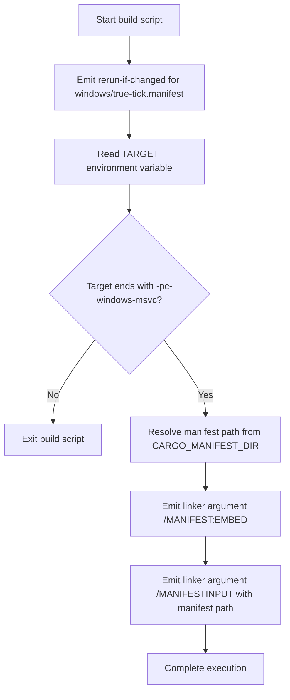

# Build Script Diagram

Source: `true-tick/apps/true-tick/build.rs`

## Notes

* Emits a cargo instruction to rerun the build script if `windows/true-tick.manifest` changes
* Reads the `TARGET` environment variable and panics if it is missing
* Checks whether the compilation target string ends with `-pc-windows-msvc`
* Returns immediately without configuring linker arguments on non-MSVC Windows targets
* Returns immediately without configuring linker arguments on non-Windows platforms
* Resolves the full path to `windows/true-tick.manifest` relative to `CARGO_MANIFEST_DIR`
* Emits a rustc binary linker flag instructing MSVC link to embed the application manifest
* Emits a rustc binary linker flag providing the resolved manifest path via `/MANIFESTINPUT`
* Scopes both linker argument instructions specifically to the `true-tick` binary target
