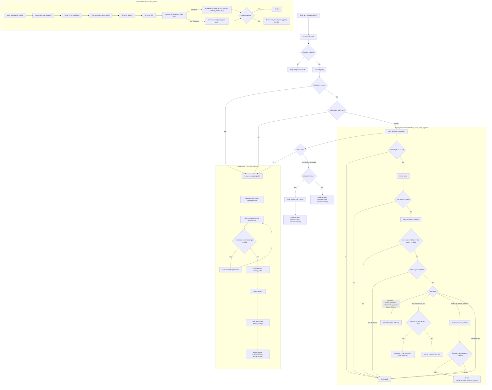

# Configuration Lifecycle and Atomic Persistence Flow

Source path: `apps/true-tick/src/config.rs`

## Notes

- Maximum configuration file size is 64 KiB, line size is 4 KiB, key size is 64 bytes, value size is 1024 bytes.
- Default configuration enables startup with automatic request interval zero and factory presets 60, 300, 900, 1800, 3600 seconds.
- `auto_resume_on_ac` defaults to true and `battery_lockout` defaults to false.
- Zero represents `AUTOMATIC_REQUEST_INTERVAL` which selects the native timer boundary.
- Legacy interval of 10000 hectonanoseconds (1 millisecond) is detected during parsing, migrated to zero, and rewritten to disk atomically.
- Corrupted UTF8 or malformed syntax triggers self-healing recovery rather than crashing or terminating the application.
- Self-healing renames the corrupt file to a timestamped backup with format `true-tick.toml.corrupted.<timestamp>.<attempt>.bak` up to 1024 attempts.
- Following backup rotation, self-healing generates and writes clean factory default configuration via atomic save.
- Atomic file saving generates a unique sidecar temporary file using process ID and monotonic sequence counter.
- Atomic persistence flushes data to disk with `sync_all` before replacing the target file.
- On Windows systems replacement uses `MoveFileExW` with `MOVEFILE_REPLACE_EXISTING` and `MOVEFILE_WRITE_THROUGH` flags.
- Schedule preset arrays are bounded between 1 and 12 entries with duration between 1 second and 86400 seconds inclusive.
