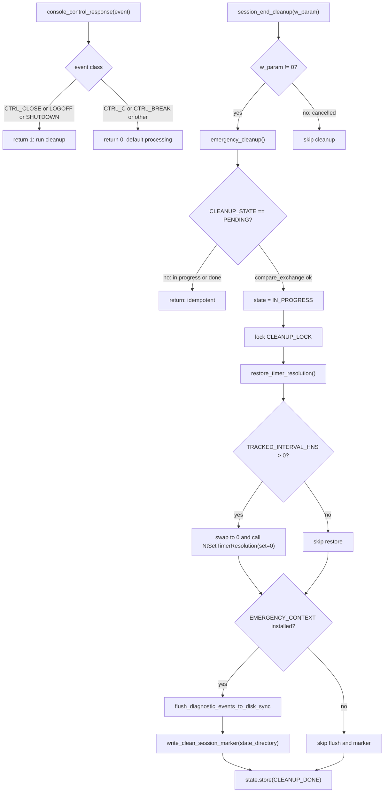

# Emergency Cleanup Flow

Source: `apps/true-tick/src/emergency.rs`

## Notes

- `emergency_cleanup` is shared by the console control handler and the `WM_ENDSESSION` window path, and it never touches `App` state.
- Idempotence uses a three-state atomic: `CLEANUP_PENDING` transitions to `CLEANUP_IN_PROGRESS` via compare_exchange, then to `CLEANUP_DONE`.
- `CLEANUP_LOCK` serializes file writes when the OS handler thread and the window thread could race into the path concurrently.
- `restore_timer_resolution` atomically swaps `TRACKED_INTERVAL_HNS` to zero first, so a second caller can never issue a duplicate `NtSetTimerResolution` call.
- `NtSetTimerResolution` is called with `set_resolution = 0` to release the previously requested resolution, using the tracked 100ns interval.
- `TRACKED_INTERVAL_HNS` is published by the controller via `publish_tracked_interval`, which writes zero when ownership is not held.
- `console_control_response` returns 1 for close, logoff, and shutdown events so the process controls its own exit, and 0 for Ctrl+C, Ctrl+Break, and unknown events.
- `session_end_cleanup` runs only when `w_param != 0`, since a zero `wParam` means the session end was cancelled.
- `EMERGENCY_CONTEXT` is a `OnceLock` installed once at startup and holds only `Arc` clones and owned paths, keeping the handler thread free of raw `App` pointers.
- When the context is installed, cleanup flushes diagnostic events to disk synchronously via `flush_diagnostic_events_to_disk_sync`.
- `write_clean_session_marker` writes `SESSION_STATE_CLEAN` atomically so the next launch classifies the session as a clean exit.
- Unit tests verify shutdown events return 1, interruption events return 0, cleanup is idempotent, and session end cleanup runs only for nonzero `wParam`.
