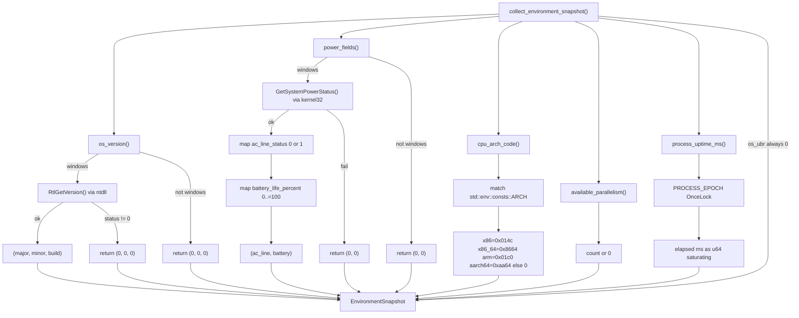

# environment.rs Diagram

Source: `apps/true-tick/src/environment.rs`

## Notes

- `collect_environment_snapshot` fills every `EnvironmentSnapshot` field except `os_ubr`, which is hardcoded to 0.
- OS version comes from `RtlGetVersion` in `ntdll` on Windows, returning `(0, 0, 0)` on failure.
- On non-Windows platforms `os_version` and `power_fields` both return zeros.
- Power status uses `GetSystemPowerStatus` from `kernel32` on Windows.
- `ac_line_status` is kept only when the API reports 0 or 1, otherwise it falls back to 0.
- `battery_percent` is kept only in the 0..=100 range, otherwise it falls back to 0.
- `cpu_arch` maps `std::env::consts::ARCH` to IMAGE_FILE_MACHINE style codes, unknown arches map to 0.
- `processor_count` uses `std::thread::available_parallelism`, mapping failure to 0.
- `uptime_ms` measures elapsed time from a lazily initialized `Instant` stored in a `OnceLock`.
- Uptime conversion saturates at `u64::MAX` on overflow.
- Two tests verify processor count plus arch code, and monotonic uptime.
