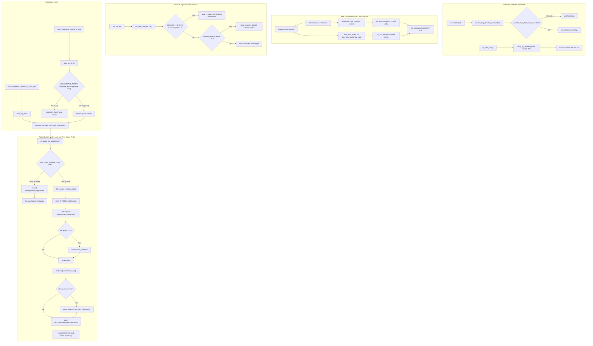

# true-tick daily CSV diagnostic logging and retention

Source: `apps/true-tick/src/logging/mod.rs`

## Notes

* Daily log directory resolves to Data/logs inside portable root when portable layout matches or falls back to logs adjacent to the executable
* Daily CSV file name is formatted as true-tick-YYYY-MM-DD.csv using UTC civil date components derived from epoch days
* CSV header LOG_HEADER is written exactly once when a log file is newly created or has zero byte length
* Mutex LOG_APPEND_LOCK serializes header inspection and writes across threads to prevent duplicate headers and torn writes
* Asynchronous flush uses atomic flag LOG_WRITER_ACTIVE with compare exchange to coalesce concurrent flush attempts into active writer passes
* Free space probe calls GetDiskFreeSpaceExW on Windows and suppresses writes if available space falls below 50 MiB threshold
* Suppressed writes record a storage.write_suppressed diagnostic entry without crashing or blocking the host application
* CSV field values are truncated to 256 UTF-8 bytes and formula injection trigger characters are escaped with a leading single quote
* Normal elapsed millisecond values beginning with plus or minus are recognized and bypass formula neutralization single quotes
* Log rows combine 11 standard diagnostic grid columns with hex formatted prev_hash and entry_hash integrity chain fields
* Expired log retention purge runs automatically when a new daily log file is first created and at startup via dedicated entry point
* Synchronous flush helper guarantees all queued diagnostic rows are written and synced to disk before process exit
