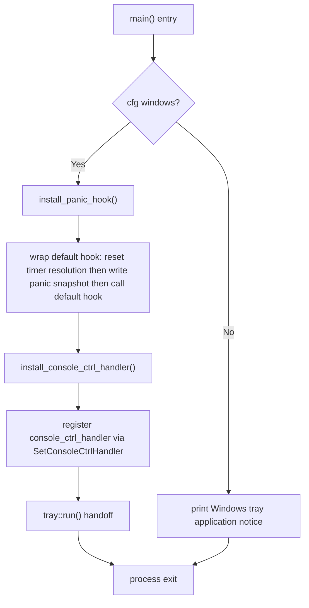

# true-tick main entry point and startup sequence

Source: `apps/true-tick/src/main.rs`

## Notes

* `windows_subsystem = "windows"` is applied for non-test Windows builds, so the release binary runs without a console window
* Nine modules are declared unconditionally (config, emergency, environment, logging, pause, portable, session, shutdown, tray_surface) while `tray` and `ui` are gated behind `cfg(windows)`
* Two extern blocks link `ntdll` for `NtSetTimerResolution` and `kernel32` for `SetConsoleCtrlHandler`, both compiled on Windows only
* `install_panic_hook` takes the default hook first, then installs a hook that unsets the timer resolution, formats the panic payload and source location, writes a `FailureVector::Panic` snapshot, and finally invokes the original default hook
* `write_panic_snapshot` resolves the executable path, the state directory via `logging::resolve_state_directory`, and an environment snapshot before delegating to `tick_diagnostics::recorder`
* All fallible calls inside the panic path discard their results with `let _`, so a failed snapshot never masks the original panic
* `install_console_ctrl_handler` registers `console_ctrl_handler` via `SetConsoleCtrlHandler` with add set to 1
* `console_ctrl_handler` delegates classification to `emergency::console_control_response` and runs `emergency::emergency_cleanup` only for events that return 1, all other events return 0 so default processing applies
* The handler runs on an OS-created thread and must never dereference pointers into `App`, which is why it only touches process-wide statics and the emergency context
* Windows `main` performs exactly three steps in order: panic hook install, console control handler install, then `tray::run()` with no post-run work
* Non-Windows `main` prints a single notice that True Tick is a Windows tray application and exits
