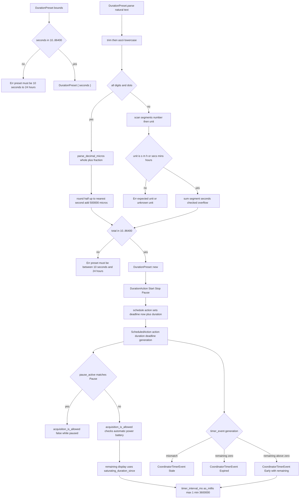

# Pause and Duration Scheduling in pause.rs

Source path: `true-tick/apps/true-tick/src/pause.rs`

## Notes

- `MIN_PRESET_SECONDS` is 10 and `MAX_PRESET_SECONDS` is 86400, which `DurationPreset::new` enforces on every construction.
- `MAX_DURATION` reuses the preset maximum, so a scheduled deadline is capped at 24 hours via `duration.duration().min(MAX_DURATION)`.
- `DurationPreset::parse` accepts whole numbers, decimal numbers, and natural segments such as "1.5 hours" and "1h 30m", rejecting empty text and unknown units.
- Decimal values are scaled to microseconds with `parse_decimal_micros`, which rejects more than six fraction digits and multiple dots.
- Each natural segment is rounded to whole seconds by adding 500000 microseconds before dividing, a round half up to the nearest second.
- The parsed total must land in the 10 to 86400 second range or parsing fails with the same bounds error as `new`.
- `DurationAction` has three variants, Start, Stop and Pause, each carrying a short label used by menu rows.
- `DurationCoordinator` holds a single `Option<ScheduledAction>` and a monotonic generation that increments on each schedule and on every cancel that clears a live action.
- A `Pause` action is treated as active while the coordinator holds an action whose variant is `Pause`, which drives `pause_active`.
- `acquisition_is_allowed` returns false whenever a pause is active, and otherwise requires automatic mode plus a policy decision of `Requested` across all power states.
- A timer event is `Stale` unless its generation matches both the coordinator generation and the action generation, which prevents an old replacement from firing.
- Remaining display time comes from `deadline.saturating_duration_since(now)`, and the refresh interval clamps that to between 1 millisecond and `MAX_TIMER_INTERVAL_MS` 3600000 milliseconds.
