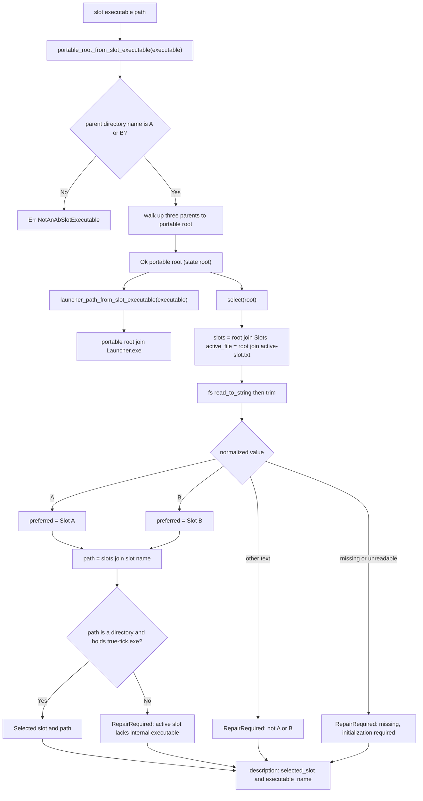

# true-tick portable A/B slot resolution

Source: `apps/true-tick/src/portable.rs`

## Notes

* Portable root is derived by walking up three parents from the slot executable, so the path must look like root/Slots/A/true-tick.exe or the B variant
* `launcher_path_from_slot_executable` reuses the same root and appends `Launcher.exe`, so the launcher always sits beside `Slots`, never inside the payload
* Any other shape returns `NotAnAbSlotExecutable`, including a bare executable or a slot folder that is not named A or B
* `Slot::name` maps `A` to "A" and `B` to "B" and is the only place the directory name is materialized
* `select` joins `Slots` and `active-slot.txt` onto the supplied root, so the caller owns the portable root decision and this module never searches for it
* `read_to_string` failure is collapsed to `None` through `ok()`, so a missing, unreadable, or non UTF-8 file is treated as uninitialized
* The file contents are trimmed before matching, so surrounding whitespace and trailing newlines are tolerated
* Only the exact trimmed strings "A" and "B" are accepted, and any other content returns `RepairRequired` with the not A or B reason
* A missing or unreadable `active-slot.txt` returns `RepairRequired` with the explicit initialization required reason
* Selection succeeds only when the preferred slot folder is a directory that also contains `true-tick.exe`
* A present but incomplete slot returns `RepairRequired` with the recognizable internal executable reason
* There is no separate state directory function, the resolved portable root doubles as the state root that holds `Slots` and `active-slot.txt`
