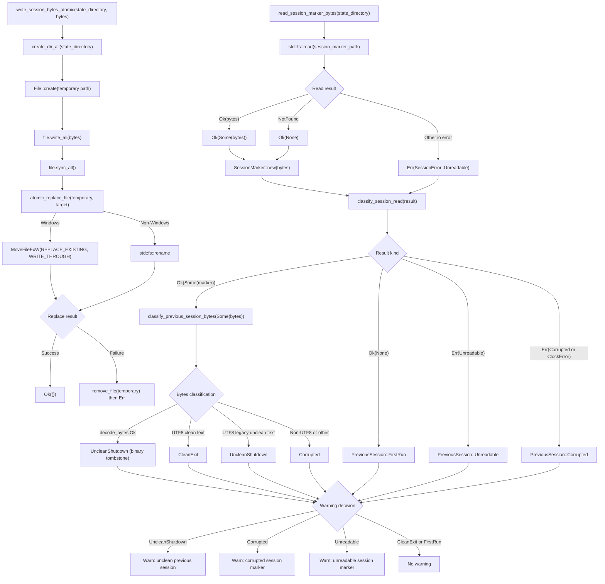

# Session Marker Read and Classify Flow

Source path: `apps/true-tick/src/session.rs`

## Notes

- Marker filename is `session.state` inside the state directory.
- Binary tombstone layout: 4 byte magic `TTSS`, 2 byte version `v1`, 32 byte SHA256 checksum, 4 byte little endian pid, 8 byte little endian startup timestamp, total 50 bytes.
- Checksum covers magic plus version plus pid plus timestamp so decode rejects truncation, magic mismatch, version mismatch, and checksum mismatch.
- A missing marker file yields `Ok(None)` and classifies as `FirstRun`.
- Non missing io errors map to `Unreadable`, which classifies distinctly from `FirstRun`.
- Valid binary tombstone means the previous session was still running, so it classifies as `UncleanShutdown`.
- Legacy UTF8 text `clean` classifies as `CleanExit`. `running` and prefixes `state=running` or `state=aborted` classify as `UncleanShutdown`.
- Non UTF8 bytes or unrecognized UTF8 content classify as `Corrupted`.
- `classify_session_read` maps `ClockError` to `Corrupted` and `Unreadable` errors to `Unreadable`.
- Atomic write creates a `session.state.tmp.<pid>` file, writes bytes, calls `sync_all`, then replaces the target.
- On Windows the replace uses `MoveFileExW` with `MOVEFILE_REPLACE_EXISTING` and `MOVEFILE_WRITE_THROUGH`. Other platforms use `std::fs::rename`.
- `write_aborted_session_marker` appends a sanitized and truncated reason after the verified tombstone header so the next launch still decodes as unclean.
