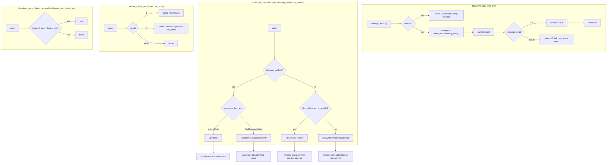

# shutdown.rs flow

Source: `true-tick/apps/true-tick/src/shutdown.rs`

## Notes

- `ShutdownGate` holds exactly two fields, `verified` and `attempts`, and both start false and zero via `new`.
- `attempt` is once-only by design. Once `verified` is true it returns `Ok(())` immediately and never runs the closure again.
- `attempts` increments with `saturating_add` before the closure runs, so a failed try is still counted.
- A failed closure returns `Err(e)` and leaves `verified` false, which keeps the gate retryable for a later attempt.
- A successful closure flips `verified` to true, so all later calls become no-ops and the native release runs at most once.
- `message_loop_exit` maps `0` to `NormalQuit`, `-1` to `GetMessageFailed { raw_error }`, and any other value to `None`.
- `shutdown_disposition` branches on `cleanup_verified` first, so cleanup state dominates the message loop outcome.
- With cleanup verified, `NormalQuit` yields `Complete` while `GetMessageFailed` yields `ExitAfterMessageLoopError`, so a loop error is never reported as a normal shutdown.
- With cleanup unverified, only `NormalQuit` plus a usable UI yields `KeepAliveForRetry`, which is the single case that keeps the process alive.
- Any unverified cleanup combined with a failed message loop or an unusable UI yields `ExitWithUnresolvedCleanup`.
- `shutdown_pump_bound_exceeded` is an inclusive bound, returning true when `elapsed_ms` equals `bound_ms`, and it expects monotonic elapsed time.
- The test module covers repeated release guarding, retry after failure, the disposition truth table, and both pump bound edges.
