# Tray commands constants and toggle handlers

Source path: `true-tick/apps/true-tick/src/tray/commands.rs`

```mermaid
flowchart TD
    subgraph CONST["Constant Tables"]
        K1["window message ids WM_APP WM_TRAY WM_APP_IPC WM_CREATE WM_COMMAND WM_DESTROY WM_POWERBROADCAST WM_TIMER WM_MENUSELECT"]
        K2["power broadcast codes PBT_APMPOWERSTATUSCHANGE PBT_APMSUSPEND PBT_APMRESUMESUSPEND PBT_APMRESUMEAUTOMATIC"]
        K3["timer ids HANDOFF DURATION_BASE plus MASK SURFACE_RECOVERY POPUP_REFRESH SCHEDULE_DISPLAY POWER_DEBOUNCE HEARTBEAT"]
        K4["menu command ids ID_START ID_STOP ID_QUIT ID_STARTUP ID_AUTOMATIC ID_AUTO_RESUME ID_BATTERY_LOCKOUT ID_SETTINGS_RESET ID_RESET"]
        K5["win32 style and control constants EN_CHANGE BN_CLICKED WS_* EM_LIMITTEXT ES_* BS_* SS_LEFT SW_* MB_* IDYES ABE_*"]
    end

    subgraph HELPERS["Startup Helpers"]
        T0["startup_rollback enabled"] --> T0A{"enabled"}
        T0A -->|true| T0B["SkipDestructiveInverse"]
        T0A -->|false| T0C["RestoreRegistration"]
        T1["bounded_startup_status"] --> T1A["truncate_utf8 to MAX_STARTUP_STATUS_BYTES"]
        T2["startup_target executable"] --> T2A{"launcher_path_from_slot_executable"}
        T2A -->|Ok| T2B["PortableLauncher"]
        T2A -->|Err and debug and is_development_executable| T2C["DevelopmentExecutable"]
        T2A -->|Err otherwise| T2D["Err portable launcher path unavailable"]
        T3["register_startup_target"] --> T3A{"target variant"}
        T3A -->|PortableLauncher| T3B["WindowsUserStartup register path"]
        T3A -->|DevelopmentExecutable| T3C["WindowsUserStartup register_development path"]
    end

    subgraph TOGGLES["Config Toggle Handlers"]
        A0["set_automatic app enabled"] --> A1["record tray.command toggle.requested policy.automatic_setting_changed"]
        A1 --> A2["clone config, next.automatic = enabled"]
        A2 --> A3{"save_atomic"}
        A3 -->|Err| A4["record config.save.result error, toggle.result unchanged, publish, return"]
        A3 -->|Ok| A5["record save success, app.config = next, toggle.result applied"]
        A5 --> A6{"enabled"}
        A6 -->|true| A7["super::reconcile"]
        A6 -->|false| A8["super::manual_stop"]

        R0["set_auto_resume app enabled"] --> R1["record tray.command toggle.requested policy.auto_resume_setting_changed"]
        R1 --> R2["clone config, next.auto_resume_on_ac = enabled"]
        R2 --> R3{"save_atomic"}
        R3 -->|Err| R4["record save error, toggle.result unchanged, publish, return"]
        R3 -->|Ok| R5["record save success, app.config = next, toggle.result applied"]
        R5 --> R6["apply_power_reconciliation"]

        B0["set_battery_lockout app enabled"] --> B1["record tray.command toggle.requested policy.battery_lockout_setting_changed"]
        B1 --> B2["clone config, next.battery_lockout = enabled"]
        B2 --> B3{"save_atomic"}
        B3 -->|Err| B4["record save error, toggle.result unchanged, publish, return"]
        B3 -->|Ok| B5["record save success, app.config = next, toggle.result applied"]
        B5 --> B6{"enabled"}
        B6 -->|false| B7["clear last_block_reason"]
        B6 -->|true| B8["skip clearing"]
        B7 --> B9["apply_power_reconciliation"]
        B8 --> B9
    end

    subgraph STARTUP["set_startup Flow"]
        S0["set_startup app enabled"] --> S1["record tray.command toggle.requested"]
        S1 --> S2{"enabled"}
        S2 -->|true| S3{"startup_target"}
        S3 -->|Err| S4["record startup.registration.result unavailable"]
        S4 --> S5["next.startup_enabled = true then save_atomic"]
        S5 -->|save Err| S6["startup_status unavailable and persistence failed, publish, return"]
        S5 -->|save Ok| S7["startup_status enabled in config registration unavailable, publish, return"]
        S3 -->|Ok target| S8["record native.RegSetValueExW.call then register_startup_target"]
        S2 -->|false| S9["record native.RegDeleteValueW.call then WindowsUserStartup remove"]
        S8 --> S10{"registration result"}
        S9 --> S10
        S10 -->|Err| S11["record registration error, toggle.result unchanged, startup_status error, publish, return"]
        S10 -->|Ok| S12["next.startup_enabled = enabled then save_atomic"]
        S12 -->|save Err| S13{"startup_rollback enabled"}
        S13 -->|SkipDestructiveInverse| S14["record rollback_skipped non_destructive_policy"]
        S13 -->|RestoreRegistration| S15["re-resolve startup_target then register_startup_target"]
        S14 --> S16["record rollback result, toggle.result unchanged, startup_status repair note, publish, return"]
        S15 --> S16
        S12 -->|save Ok| S17["record save success, app.config = next, toggle.result applied, registration success"]
        S17 --> S18["startup_status registered for target or disabled by config, publish"]
    end

    subgraph GITHUB["open_github_page"]
        G0["open_github_page hwnd app"] --> G1["wide open verb and GITHUB_URL"]
        G1 --> G2["ShellExecuteW SW_SHOWNORMAL"]
        G2 --> G3{"result as isize less or equal 32"}
        G3 -->|yes| G4["record native.ShellExecuteW.github.error with GetLastError Failed"]
        G3 -->|no| G5["record native.ShellExecuteW.github.result success"]
    end
```

## Notes

- `startup_rollback` is a const decision table. Enabling startup skips the destructive inverse after a config save failure because leaving the registration in place matches the requested config, while disabling re-registers to restore the prior state.
- `set_startup` writes config even when registration is unavailable on enable, so the menu reflects the requested intent and `startup_status` carries the repair text.
- `DevelopmentExecutable` is only reachable under `cfg!(debug_assertions)` and only when `is_development_executable` accepts the path, so release builds always require the portable launcher layout.
- `set_battery_lockout` clears `last_block_reason` only on disable so a stale block message cannot outlive the restriction that produced it.
- `ShellExecuteW` treats any return value of 32 or less as failure per the Win32 contract, and the error path records `GetLastError` immediately on the same thread.
- `set_auto_resume` is marked `#[allow(dead_code)]` and applies `apply_power_reconciliation` unconditionally since the pending flag gates the actual acquire.
- `bounded_startup_status` truncates through `truncate_utf8` so the status line never exceeds `MAX_STARTUP_STATUS_BYTES` on a UTF-8 boundary.
