# Tray Controller run Loop and Dispatch Spine

Source path: `true-tick/apps/true-tick/src/tray/controller.rs`

```mermaid
flowchart TD
    subgraph SPINE["Main Control Spine and Message Loop"]
        A["run entry"] --> B["CreateMutexW single instance"]
        B --> C{"single_instance_decision"}
        C -- "Failure" --> C1["record and exit(1)"]
        C -- "ExistingInstance" --> C2["register message, FindWindow, notify, MessageBox, exit(0)"]
        C -- "Proceed" --> D["hold SingleInstanceGuard"]
        D --> E["resolve log and state dirs, read session marker"]
        E --> F{"classify_session_read"}
        F -- "unclean or unreadable" --> F1["show unclean shutdown warning"]
        F -- "corrupted" --> F2["record anomaly and warning"]
        F -- "clean or first run" --> F3["record clean start"]
        F1 --> G["write session tombstone"]
        F2 --> G
        F3 --> G
        G --> H{"portable_root_from_slot_executable"}
        H -- "Ok" --> H1["portable active slot selection"]
        H -- "Err" --> H2["not portable slot layout"]
        H1 --> I["config load_with_migration"]
        H2 --> I
        I -- "Ok" --> I1["record success"]
        I -- "Err" --> I2["default config and Red note"]
        I1 --> J["startup registration register or remove"]
        I2 --> J
        J --> K["refresh_power observation"]
        K -- "Err" --> K1["tray_status Degraded"]
        K -- "Ok" --> K2["tray_status Stopped"]
        K1 --> L["register TaskbarCreated and AnotherInstance messages"]
        K2 --> L
        L --> M["build App, install emergency context, begin Startup"]
        M --> N["GetModuleHandleW"]
        N -- "null" --> N1["abort_startup and return"]
        N -- "ok" --> O["initialize_common_controls"]
        O -- "Err" --> O1["abort_startup and return"]
        O -- "Ok" --> P["RegisterClassW tray"]
        P -- "fail" --> P1["abort_startup and return"]
        P -- "ok" --> P2["LoadIconW"]
        P2 -- "null" --> P3["abort_startup and return"]
        P2 -- "ok" --> P4["RegisterClassW diagnostic"]
        P4 -- "fail" --> P5["abort_startup and return"]
        P4 -- "ok" --> P6["RegisterClassW presets"]
        P6 -- "fail" --> P7["abort_startup and return"]
        P6 -- "ok" --> P8["CreateWindowExW tray"]
        P8 -- "fail" --> P9["abort_startup and return"]
        P8 -- "ok" --> Q["NotifyIconData new"]
        Q -- "Err" --> Q1["abort_after_window and return"]
        Q -- "Ok" --> Q2["Shell_NotifyIconW NIM_ADD"]
        Q2 -- "failed" --> Q3["drop icon, abort_after_window and return"]
        Q2 -- "ok" --> Q4["store tray icon and hwnd"]
        Q4 --> R{"IpcServer new"}
        R -- "Ok" --> R1["store server"]
        R -- "Err" --> R2["record start_failed"]
        R1 --> S["refresh tier, timing, settle probe, power reconcile, flush"]
        R2 --> S
        S --> T["finish operation, heartbeat kick, SetTimer heartbeat"]
        T --> T1{"SetTimer heartbeat"}
        T1 -- "0" --> T2["record armed failed"]
        T1 -- "ok" --> T3["last_heartbeat_fire set"]
        T2 --> U["spawn WatchdogHandle"]
        T3 --> U
        U --> V["shutdown_pump_start"]

        V --> ML["run_message_loop"]
        ML -- "GetMessageW greater 0" --> D1["dispatch with catch_unwind"]
        D1 -- "panic caught" --> D2["increment CAUGHT_DISPATCH_PANICS"]
        D1 --> WPROC["window_proc dispatch"]
        D2 --> ML
        WPROC --> ML
        ML -- "GetMessageW 0" --> MLQ["NormalQuit"]
        ML -- "GetMessageW -1" --> MLF["GetMessageFailed with raw error"]
        MLQ --> CLEAN["cleanup_normal_shutdown"]
        MLF --> CLEAN
        CLEAN --> CLEANR{"cleanup_result is_ok"}
        CLEANR -- "false and bound exceeded" --> BND["record pump_bound_exceeded, show warning, break"]
        CLEANR -- "true" --> DISP{"shutdown_disposition"}
        CLEANR -- "false" --> DISP2{"shutdown_disposition"}
        DISP -- "Complete" --> DONE["record normal shutdown, break"]
        DISP -- "KeepAliveForRetry" --> KA["status Unverified, publish, warning, loop again"]
        DISP -- "ExitAfterMessageLoopError" --> EL["record, warning, break"]
        DISP -- "ExitWithUnresolvedCleanup" --> EU["record, warning, break"]
        DISP2 -- "NormalQuit and ui usable" --> KA
        DISP2 -- "otherwise" --> EU
        KA --> ML
        DONE --> FIN
        BND --> FIN
        EL --> FIN
        EU --> FIN
        FIN["remove tray icon, destroy windows, mark_session_clean, flush, drop App"]

        WPROC --> W1["WM_CREATE set userdata"]
        WPROC --> W2["WM_TRAY opens menu"]
        W2 --> W2A["show_menu"]
        WPROC --> W3["WM_COMMAND"]
        W3 --> W3A["ID_SETTINGS_RESET"]
        W3 --> W3B["handle_menu_command dispatch"]
        W3A --> W3C["handle_settings_reset"]
        WPROC --> W4["WM_MENUSELECT"]
        W4 --> W4A["update_menu_help"]
        WPROC --> W5["WM_TIMER"]
        W5 --> W5A["refresh_popup_menu popup timer"]
        W5 --> W5B["handle_schedule_display_timer"]
        W5 --> W5C["handle_power_debounce_timer"]
        W5 --> W5D["handle_handoff_timer"]
        W5 --> W5E["handle_heartbeat_timer"]
        W5 --> W5F["service_surface_recovery"]
        W5 --> W5G["handle_duration_timer"]
        WPROC --> W6["WM_APP_IPC"]
        W6 --> W6A["drain_ipc_command_queue"]
        WPROC --> W7["WM_POWERBROADCAST"]
        W7 --> W7A["APMSUSPEND release_for_power_change"]
        W7 --> W7B["resume refresh reconcile handle broadcast"]
        W7 --> W7C["statuschange refresh handle broadcast"]
        W7 --> W7D["unrecognized refresh reconcile handle broadcast"]
        WPROC --> W8["WM_QUERYENDSESSION return 1"]
        WPROC --> W9["WM_ENDSESSION session_end_cleanup"]
        WPROC --> W10["WM_CLOSE handle_menu_command ID_QUIT"]
        WPROC --> W11["WM_DESTROY teardown drain PostQuitMessage"]
        WPROC --> W12["default DefWindowProcW"]
    end

    subgraph IPC["IPC Command Handlers"]
        W6A --> H1["handle_ipc_command verb match"]
        H1 -- "RequestAcquire" --> HA["handle_ipc_acquire"]
        H1 -- "RequestRelease" --> HR["manual_stop then Released"]
        H1 -- "ScheduleAction" --> HS["handle_ipc_schedule"]
        H1 -- "CancelSchedule" --> HC["handle_ipc_cancel_schedule"]
        H1 -- "QueryStatus" --> HQ["Error Unsupported, never reaches drain"]

        HA --> HA1{"payload empty"}
        HA1 -- "nonempty and len not 8" --> HA2["Error PayloadTruncated"]
        HA1 -- "nonempty len 8" --> HA3{"validate_interval_hns"}
        HA3 -- "Err" --> HA4["Error from validation"]
        HA3 -- "Ok" --> HA5["set request_interval then manual_start"]
        HA1 -- "empty" --> HA5
        HA5 --> HA6{"timing valid"}
        HA6 -- "false" --> HA7["Error Unsupported"]
        HA6 -- "true" --> HA8["Acquired with effective_hns"]

        HS --> HS1{"payload len 5"}
        HS1 -- "false" --> HS2["Error PayloadTruncated"]
        HS1 -- "true" --> HS3{"schedule tag"}
        HS3 -- "unknown" --> HS4["Error Unsupported"]
        HS3 -- "start stop pause" --> HS5{"DurationPreset new"}
        HS5 -- "Err" --> HS6["Error ScheduleOutOfBounds with seconds"]
        HS5 -- "Ok" --> HS7["schedule_duration_action"]
        HS7 --> HS8{"pause active"}
        HS8 -- "false" --> HS9["cancel action, record arm_failed, Error Unsupported"]
        HS8 -- "true" --> HS10["increment id then Scheduled with action_id"]

        HC --> HC1{"payload empty"}
        HC1 -- "nonempty and len not 4" --> HC2["Error PayloadTruncated"]
        HC1 -- "nonempty len 4" --> HC3{"requested id equals current"}
        HC3 -- "false" --> HC4["Error ScheduleIdMismatch with provided"]
        HC3 -- "true" --> HC5["cancel_scheduled_action"]
        HC1 -- "empty" --> HC5
        HC5 --> HC6["Cancelled"]
    end
```

## Notes

- Single instance uses mutex error `ERROR_ALREADY_EXISTS` 183, and an existing instance exits with code 0 after posting a notify message.
- `cleanup_normal_shutdown` stops the IPC server and the watchdog before it inspects the shutdown gate.
- The shutdown gate only verifies after ownership release settles, so an unresolved release returns Err and the pump retries under `KeepAliveForRetry`.
- `SHUTDOWN_PUMP_BOUND_MS` is 50 ms and forces exit even when cleanup cannot verify.
- `ipc_schedule_id` is monotonic and is minted only after a schedule arm succeeds, using saturating add then a floor of 1 so the first id is never 0.
- Cancel schedule with an empty payload cancels without an id check, while a 4 byte payload requires the exact current id.
- `WM_DESTROY` sets IPC teardown before draining the queue so late requests fail fast instead of waiting the full wait timeout.
- The message loop survives window proc panics through `catch_unwind` and folds them into `CAUGHT_DISPATCH_PANICS` rather than aborting.
- `QueryStatus` is answered on the server thread and never reaches the drain path, so the drain only sees mutating verbs.
- Schedule and cancel validate payload lengths of 5 and 4 respectively before acting.
- Power debounce rearms its timer when the observed power state is `Unknown` to wait for a stable reading.
- Teardown order after the pump is tray icon removal, diagnostic window destroy, user data clear and `DestroyWindow`, session marker removal, final log flush, then dropping the App box.
