# Tray diagnostics_map keyword classifiers

Source path: `true-tick/apps/true-tick/src/tray/diagnostics_map.rs`

```mermaid
flowchart TD
    subgraph NUMERIC["numeric_detail"]
        N0["numeric_detail details key"] --> N1["split details on whitespace"]
        N1 --> N2["find_map field split_once equals sign"]
        N2 --> N3{"field_key equals key"}
        N3 -->|no| N4["skip field"]
        N3 -->|yes| N5["parse value as i64"]
        N5 --> N6["Option i64"]
    end

    subgraph NATIVE["native_outcome"]
        O0["native_outcome name details"] --> O1["raw_status and raw_error from numeric_detail"]
        O1 --> O2{"name contains Nt or starts timer."}
        O2 -->|yes| O3["ntstatus = raw_status narrowed to i32"]
        O2 -->|no| O4["ntstatus = None"]
        O3 --> O5{"name has GetLastError or raw_error present or native. prefix without ntstatus"}
        O4 --> O5
        O5 -->|yes| O6["win32_last_error = raw_error or GetLastError fallback raw_status or native. fallback raw_status narrowed to u32"]
        O5 -->|no| O7["win32_last_error = None"]
        O6 --> O8["NativeOutcome with ntstatus, win32_last_error, requested_hns, selected_hns, effective_hns as u64"]
        O7 --> O8
    end

    subgraph PHASE["diagnostic_phase keyword ladder"]
        P0["diagnostic_phase name"] --> P1{"contains handoff"}
        P1 -->|yes| PH["Handoff"]
        P1 -->|no| P2{"contains policy"}
        P2 -->|yes| PD["Decide"]
        P2 -->|no| P3{"contains duration or pause"}
        P3 -->|yes| PT["Timer"]
        P3 -->|no| P4{"contains shutdown or quit"}
        P4 -->|yes| PS["Shutdown"]
        P4 -->|no| P5{"contains query or observation"}
        P5 -->|yes| PO["Observe"]
        P5 -->|no| P6{"contains acquire or request"}
        P6 -->|yes| PA["Acquire"]
        P6 -->|no| P7{"contains release or stop"}
        P7 -->|yes| PR["Release"]
        P7 -->|no| P8{"contains verification"}
        P8 -->|yes| PV["Verify"]
        P8 -->|no| P9{"contains config or startup"}
        P9 -->|yes| PP["Persist"]
        P9 -->|no| P10{"contains window or tray.status"}
        P10 -->|yes| PRE["Render"]
        P10 -->|no| PC["Complete"]
    end

    subgraph OUTCOME["diagnostic_outcome keyword ladder"]
        U0["diagnostic_outcome name details"] --> U1["lowercase name plus details"]
        U1 --> U2{"contains timedout or timeout"}
        U2 -->|yes| UT["TimedOut"]
        U2 -->|no| U3{"contains suppressed"}
        U3 -->|yes| US["Suppressed"]
        U3 -->|no| U4{"contains cancel"}
        U4 -->|yes| UC["Cancelled"]
        U4 -->|no| U5{"contains unverified or uncertain"}
        U5 -->|yes| UU["Unverified"]
        U5 -->|no| U6{"contains error or failed"}
        U6 -->|yes| UF["Failed"]
        U6 -->|no| U7{"contains started or pending"}
        U7 -->|yes| UI["InProgress"]
        U7 -->|no| UD["Completed"]
    end

    subgraph SOURCE["diagnostic_source keyword ladder"]
        W0["diagnostic_source name"] --> W1{"contains power"}
        W1 -->|yes| WP["PowerEvent"]
        W1 -->|no| W2{"contains startup"}
        W2 -->|yes| WS["Startup"]
        W2 -->|no| W3{"contains pause"}
        W3 -->|yes| WPS["Pause"]
        W3 -->|no| W4{"contains resume"}
        W4 -->|yes| WR["Resume"]
        W4 -->|no| W5{"contains handoff"}
        W5 -->|yes| WH["Handoff"]
        W5 -->|no| W6{"contains duration"}
        W6 -->|yes| WT["Timer"]
        W6 -->|no| W7{"contains shutdown or quit"}
        W7 -->|yes| WSD["Shutdown"]
        W7 -->|no| W8{"contains policy"}
        W8 -->|yes| WPL["Policy"]
        W8 -->|no| W9{"contains ownership"}
        W9 -->|yes| WO["Ownership"]
        W9 -->|no| W10{"starts native. or timer."}
        W10 -->|yes| WN["Native"]
        W10 -->|no| W11{"contains tray.command"}
        W11 -->|yes| WC["TrayCommand"]
        W11 -->|no| WI["Internal"]
    end
```

## Notes

- All three classifiers are pure keyword ladders evaluated in source order, so an earlier substring wins over a later one when a name matches both.
- `diagnostic_outcome` lowercases `name` and `details` joined with a space, so outcome hints inside the details payload classify the event just like the name does.
- `TimedOut` checks both `timedout` and `timeout` because recorded details use the single word form while callers sometimes log the two word form.
- `native_outcome` only promotes `raw_status` to `ntstatus` when the name signals an NT call via `Nt` or the `timer.` prefix, and only derives `win32_last_error` when the name or fields prove a Win32 context.
- The `win32_last_error` fallback chain prefers an explicit `raw_error` field, then `raw_status` for `GetLastError` names, then `raw_status` for any `native.` name that produced no `ntstatus`.
- `diagnostic_source` checks `power` before `startup`, so an event named with both lands on `PowerEvent` rather than `Startup`.
- The catch all phase is `Complete` and the catch all source is `Internal`, so unrecognized names still bucket cleanly instead of panicking.
