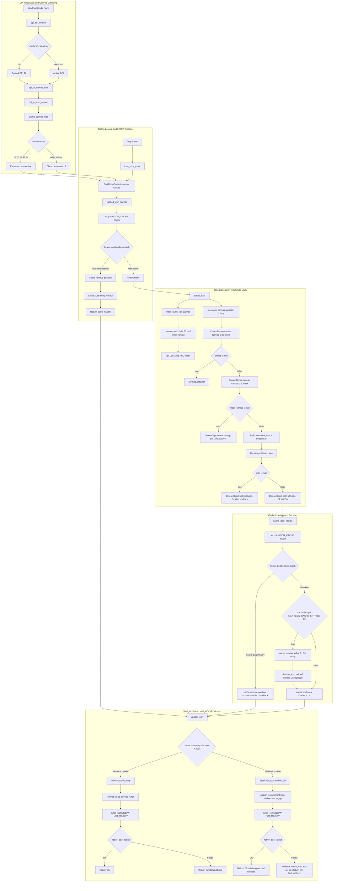

# Tray Icon Rendering, Caching, and Notification Transitions

Source path: `true-tick/apps/true-tick/src/tray/icon.rs`

## Notes

- DPI translation falls back to 96 when `GetDpiForWindow` returns 0 for a window handle.
- Canvas dimensions are clamped strictly to valid buckets 16, 20, 24, 32, and 64 pixels with any unexpected size collapsing to 16.
- The 1bpp AND mask scan lines are padded to 4 byte boundaries using `(((canvas + 31) / 32) * 4) * canvas` bytes.
- The 32bpp color bitmap buffer allocates `canvas * canvas` elements filled with `icon_pixel_color` for opaque status visuals.
- GDI bitmaps are cleaned up via `DeleteObject` unconditionally after `CreateIconIndirect` completes or fails.
- The cache lookup promotes accessed entries to the back of the vector to maintain recency ordering.
- Cache capacity is bounded at 32 entries, evicting index 0 and releasing the Win32 handle with `destroy_icon` when full.
- Updating an existing cache key updates its handle and shifts the entry to the most recently used tail position.
- Unchanged icon handles skip icon handle swapping and call `refresh_tooltip_only` to update only `sz_tip`.
- Failed `Shell_NotifyIconW` calls during icon updates restore the previous `h_icon` and `sz_tip` state.
- `NotifyIconData` drop zeros its `h_icon` field so cached handles remain owned by `ICON_CACHE` without premature destruction.
- Shutdown releases all cached icons in `clear_icon_cache` after tray registration removal via `NIM_DELETE`.
