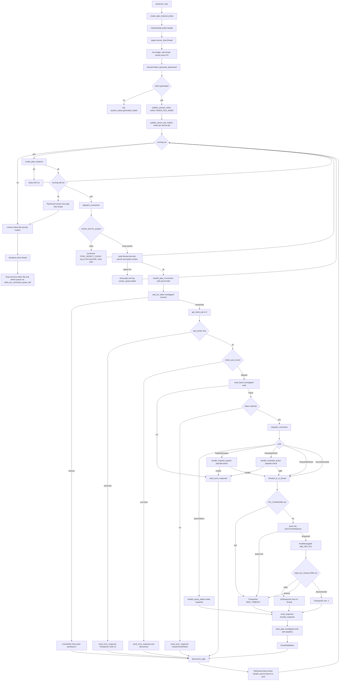

# tray/ipc.rs

Source path: `apps/true-tick/src/tray/ipc.rs`

## Notes

- Worker pool cap is `MAX_CONCURRENT_WORKERS` at 8. Acquisition is non blocking so a saturated pool rejects the connection instead of queueing a waiter.
- `PoolPermit` is RAII and returns the slot on drop, with a debug assertion that the count stays below the cap.
- A saturated rejection increments `POOL_REJECT_COUNT` and logs only on the first rejection and every 64th so a flood cannot drown stderr.
- `IPC_TEARDOWN` is a global `AtomicBool` set through `set_ipc_teardown`. When set, `forward_to_ui_thread` fails immediately with `TransportIo` and `WAIT_TIMEOUT`.
- The PID marker file name is `ipc-server-pid`, written beside the token file through `write_restricted_bytes` with the same SDDL DACL.
- The token file uses `TOKEN_FILE_NAME` inside the state directory and is retracted both on accept loop exit and in `IpcServer::drop`.
- A poisoned rate limiter mutex is fatal for that connection, which replies with `TransportIo` and the raw code `ERROR_INVALID_DATA` of 13.
- `read_frame` bounds its overlapped read by `PIPE_READ_DEADLINE_MS` at 500 ms and `write_pipe` by `PIPE_WRITE_DEADLINE_MS`.
- `forward_to_ui_thread` blocks on a one shot reply channel for at most `IPC_COMMAND_WAIT_MS` at 5000 ms.
- The rate limiter prunes idle callers every 8 accepted connections to bound the records table.
- `PipeGuard` closes the raw handle exactly once on every path, including pool rejection and worker spawn failure.
- `IpcServer::new` probes one pipe instance and closes it before spawning so a persistent creation failure reaches the caller.
