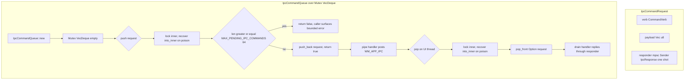

# Tray ipc_queue bounded command queue

Source path: `true-tick/apps/true-tick/src/tray/ipc_queue.rs`

## Notes

- `MAX_PENDING_IPC_COMMANDS` caps the backlog at 64 pending requests. A saturated queue returns `false` so the pipe handler answers with a bounded error instead of buffering without limit.
- Both `push` and `pop` recover the `VecDeque` through `into_inner` on a poisoned mutex, so a panicking thread cannot permanently wedge the queue between the server thread and the UI thread.
- The queue is FIFO through `push_back` and `pop_front`, which preserves client ordering across `WM_APP_IPC` drains.
- The responder is a one shot `mpsc::Sender` owned by the request, so the reply channel travels with the queued item and the pipe worker blocks on it until the UI thread answers or the wait times out.
