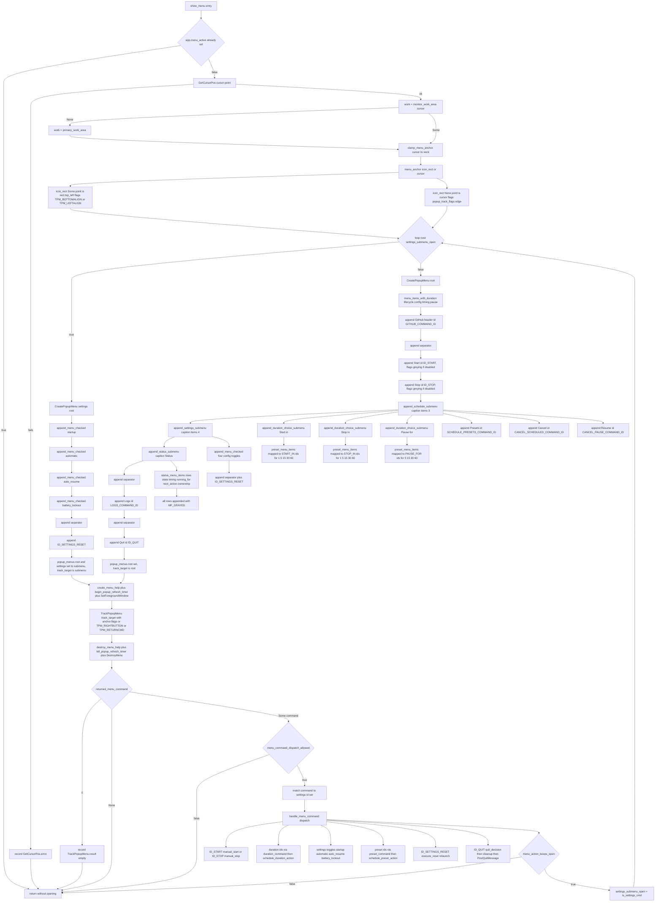

# Tray Menu Construction and Tracking Loop

Source path: `true-tick/apps/true-tick/src/tray/menu.rs`

## Notes

- Root menu positions used by the refresh timer are `ROOT_MENU_START_POSITION` 2 and `ROOT_MENU_STOP_POSITION` 3.
- `ROOT_MENU_SETTINGS_POSITION` 5, `SCHEDULE_MENU_PRESETS_POSITION` 4 and `SETTINGS_MENU_RESET_POSITION` 5 are declared but marked `allow(dead_code)`.
- The settings submenu positions are `SETTINGS_MENU_AUTO_START_POSITION` 0, `SETTINGS_MENU_AUTO_TIME_POSITION` 1, `SETTINGS_MENU_AUTO_RESUME_POSITION` 2 and `SETTINGS_MENU_BATTERY_LOCKOUT_POSITION` 3.
- The schedule submenu positions are `SCHEDULE_MENU_CANCEL_POSITION` 6 and `SCHEDULE_MENU_RESUME_POSITION` 7.
- Commands that keep the popup open are reported by `menu_action_keeps_open`. Settings toggles reopen the loop with `settings_submenu_open` set to true.
- `handle_menu_command` returns false for the quit, reset and rejected paths, which ends the tracking loop.
- The anchor clamp uses `clamp_menu_anchor` with `max_x = work.right - 1` and `max_y = work.bottom - 1`, both floored at the work area left and top.
- Work area lookup uses `monitor_work_area` with `MONITOR_DEFAULTTONEAREST` and falls back to `primary_work_area` built from `SM_CXWORKAREA` and `SM_CYWORKAREA`.
- When the icon rect is available the menu grows upward and rightward from the icon top left corner. Otherwise it anchors at the clamped cursor with taskbar edge flags.
- `TrackPopupMenu` always adds `TPM_RIGHTBUTTON` and `TPM_RETURNCMD`, so the command id arrives as the return value, not as a `WM_COMMAND`.
- Tooltip handling creates a `tooltips_class32` window in `create_menu_help`, adds it with `TTM_ADDTOOLW`, tracks it with `TTM_TRACKPOSITION` and `TTM_TRACKACTIVATE` in `update_menu_help`, and tears it down in `destroy_menu_help`.
- `refresh_popup_menu` runs on `POPUP_REFRESH_TIMER_ID` and rewrites Start, Stop, the settings toggles, the schedule cancel and resume rows, and all greyed status rows via `ModifyMenuW`.