# Tray Module Root Wiring

Source path: `true-tick/apps/true-tick/src/tray/mod.rs`

```mermaid
flowchart TD
    A["tray/mod.rs, thin module root"] --> B["declare 15 submodules plus cfged test_harness"]
    A --> C["re-export submodule surface"]
    A --> D["inline list_view_native Win32 shims"]
    A --> E["menu thin wrappers"]
    A --> F["cfged tests module"]

    B --> B1["commands, controller, diagnostics_map, icon, ipc, ipc_queue"]
    B --> B2["menu, native, power, quit, reset, schedule, status, surface, tier"]
    B --> B3["test_harness only under cfg(test)"]

    C --> C1["pub use controller::run"]
    C --> C2["pub(crate) use controller::App"]
    C --> C3["icon re-exports DeleteObject, GetDpiForWindow, GetLastError, icon star"]
    C --> C4["glob re-exports commands, diagnostics_map, ipc_queue"]
    C --> C5["glob re-exports native, power, quit, reset, schedule"]
    C --> C6["glob re-exports status, surface, tier"]
    C --> C7["re-export tick_diagnostics DiagnosticOutcome and DiagnosticSource"]
    C --> C8["re-export tick_policy PowerState"]

    D --> D1["LVS and LVM message and style constants"]
    D --> D2["LVN notification codes, VK modifiers, WM_NOTIFY"]
    D --> D3["repr C ListViewColumn, ListViewItem"]
    D --> D4["repr C NotifyHeader, ListViewNotification, ListViewKeyDownNotification"]

    E --> E1["show_menu delegates to menu::show_menu"]
    E --> E2["refresh_popup_menu delegates to menu::refresh_popup_menu"]
    E --> E3["handle_menu_command delegates to menu::handle_menu_command"]

    F --> F1["uses super star glob imports, exercises re-exported API only"]
```

## Notes

- `mod.rs` is a thin module root. It declares submodules, re-exports their public surface, and holds only the inline `list_view_native` shims plus three menu thin wrappers. Schedule coordination, power debounce, and publication logic now live in their own submodules (`schedule.rs`, `power.rs`, `status.rs`, `controller.rs`).
- Declaration order: `commands (crate)`, `controller (public)`, `diagnostics_map (crate)`, `icon (public)`, `ipc (public)`, `ipc_queue (crate)`, `menu (public)`, `native (crate)`, `power (crate)`, `quit (crate)`, `reset (crate)`, `schedule (crate)`, `status (crate)`, `surface (crate)`, `tier (crate)`, then `test_harness` guarded by `#[cfg(test)]` and marked `pub(crate)`.
- Re-export surface: `pub use controller::run` is the only fully public function path. `App` is re-exported `pub(crate)`. `icon` re-exports `DeleteObject`, `GetDpiForWindow`, `GetLastError`, and a glob `icon::*`. Every other submodule is pulled in with `pub(crate) use <module>::*`.
- The timer id constants (`HANDOFF_TIMER_ID 0x5449`, `DURATION_TIMER_ID_BASE 0x6000`, `DURATION_TIMER_ID_MASK 0x07FF`, `SURFACE_RECOVERY_TIMER_ID 0x6A00`, `POPUP_REFRESH_TIMER_ID 0x7000`, `SCHEDULE_DISPLAY_TIMER_ID 0x7100`, `POWER_DEBOUNCE_TIMER_ID 0x7200`, `HEARTBEAT_TIMER_ID 0x7300`) are declared in `commands.rs` and become visible at this path through `pub(crate) use commands::*`. The bounded duration window explanation (`0x6000` through `0x67FF` derived as `0x6000 + (generation and 0x07FF)`) belongs to `schedule.rs` and `commands.rs`, not to this wiring root.
- The menu command ids (`ID_START 1001`, `ID_STOP 1002`, `ID_QUIT 1004`, `ID_STARTUP_ON 1005`, `ID_STARTUP_OFF 1006`, and the remaining startup, automatic, auto resume, battery lockout, and reset ids) also originate in `commands.rs` and are re-exported here.
- The inline `list_view_native` module mirrors the Win32 listview contract, importing `c_void` and `Point` from `super::native`, so the diagnostic UI can build column and item structs without an external crate.
- The three menu wrappers are annotated as thin delegating wrappers, forwarding to `menu::show_menu`, `menu::refresh_popup_menu`, and `menu::handle_menu_command`.
- The `tests` module glob imports `super::*`, so it only touches the re-exported surface. `test_app` and `stub_tray_icon` come from `super::test_harness::harness`.