# Tray Module Constants, App State, Schedule and Power Debounce

Source path: `true-tick/apps/true-tick/src/tray/mod.rs`

```mermaid
flowchart TD
    A["tray/mod.rs top level"] --> B["App struct responsibilities"]
    A --> C["timer id constants"]
    A --> D["menu command ids"]
    A --> E["IpcCommandQueue with bound 64"]
    A --> F["status publication"]
    A --> G["schedule coordinator"]
    A --> H["power debounce"]
    A --> I["test_app helper"]

    C --> C1["HANDOFF 0x5449"]
    C --> C2["DURATION_TIMER_ID_BASE 0x6000"]
    C --> C3["DURATION_TIMER_ID_MASK 0x07FF"]
    C --> C4["bounded window 0x6000 to 0x67FF"]
    C --> C5["SURFACE_RECOVERY 0x6A00"]
    C --> C6["POPUP_REFRESH 0x7000"]
    C --> C7["SCHEDULE_DISPLAY 0x7100 interval 1000 ms"]
    C --> C8["POWER_DEBOUNCE 0x7200 interval 2000 ms"]
    C --> C9["HEARTBEAT 0x7300"]
    C3 --> C4

    D --> D1["ID_START 1001"]
    D --> D2["ID_STOP 1002"]
    D --> D3["ID_QUIT 1004"]
    D --> D4["ID_STARTUP_ON 1005 and OFF 1006"]
    D --> D5["ID_AUTOMATIC_ON 1007 and OFF 1008"]
    D --> D6["ID_AUTO_RESUME_ON 1009 and OFF 1010"]
    D --> D7["ID_BATTERY_LOCKOUT from tray_surface"]
    D --> D8["ID_RESET 1060 and ID_SETTINGS_RESET 1061"]

    B --> B1["controller TimerController"]
    B --> B2["observation WindowsObservation"]
    B --> B3["config Config"]
    B --> B4["tray_status TrayStatus"]
    B --> B5["pause DurationCoordinator"]
    B --> B6["presets_manager PresetsManager"]
    B --> B7["power_debounce_active and target state"]
    B --> B8["duration_timer_id and generation"]
    B --> B9["schedule_display_timer_active"]
    B --> B10["ipc_schedule_id monotonic"]
    B --> B11["heartbeat and ownership_flag"]
    B --> B12["last_publication PublicationKey"]

    G --> G1["manual_start and manual_stop"]
    G --> G2["schedule_duration_action"]
    G --> G3["schedule_preset_action"]
    G --> G4["cancel_scheduled_action"]
    G --> G5["duration_timer_id from generation"]
    G --> G6["arm_duration_timer"]
    G --> G7["handle_duration_timer Early or Expired"]
    G --> G8["execute_scheduled_action"]
    G --> G9["begin_schedule_display_timer"]
    G --> G10["handle_schedule_display_timer"]
    G2 --> G6
    G7 -- "Early" --> G6
    G7 -- "Expired" --> G8

    H --> H1["handle_power_broadcast_event"]
    H --> H2["handle_power_debounce_timer"]
    H --> H3["kill_power_debounce_timer"]
    H1 --> H2

    F --> F1["published_status degrades Running Stopped Paused"]
    F --> F2["App::publish builds PublicationKey"]
    F --> F3["refresh_operating_tier and emergency publish"]

    I --> I1["TimerController from platform diagnostics"]
    I --> I2["DurationCoordinator and PresetsManager new"]
    I --> I3["timer state None or false"]
    I --> I4["ipc_schedule_id 0 and ipc_server None"]
```

## Notes

- Duration timer ids live in the window `0x6000` through `0x67FF`, derived as `0x6000 + (generation AND 0x07FF)` so they wrap after 2048 generations and stay bounded.
- `DURATION_TIMER_ID_MASK` is `0x07FF` and the test `duration_timer_id_stays_within_bounded_window` proves the id wraps and never leaves the window.
- The bounded duration timer window collides with nothing since handoff `0x5449`, surface recovery `0x6A00`, popup refresh `0x7000`, schedule display `0x7100`, power debounce `0x7200`, and heartbeat `0x7300` are disjoint.
- `duration_timer_id` is a free function that encodes the coordinator generation into the Win32 timer id so stale timers can be rejected by id.
- `arm_duration_timer` stores both the timer id and generation, and `handle_duration_timer` ignores any fire whose id does not match `duration_timer_id` as stale.
- The schedule coordinator lives in `app.pause` as a `DurationCoordinator` and drives schedule, cancel, display, and deadline execution.
- Power debounce rearms its timer on an `Unknown` power state to wait for a stable reading and suppresses the timer when battery saver overrides immediately.
- `ipc_schedule_id` is a monotonic `u32` on the App struct that is minted only after a schedule arm succeeds, using a saturating add then a floor of 1 so the first id is never 0.
- Cancel schedule compares the requested 4 byte id against `ipc_schedule_id` and returns `ScheduleIdMismatch` when they differ, while an empty payload cancels without a check.
- `published_status` only degrades `Running`, `Stopped`, and `Paused` to `Degraded` when responsiveness is degraded, never masking a real block or error.
- `App::publish` builds a `PublicationKey` and skips redundant tray and log writes when the key is unchanged from `last_publication`.
- `test_app` builds an App with default config, fresh coordinator, null timer state, and no IPC server so unit tests can exercise logic without a window.