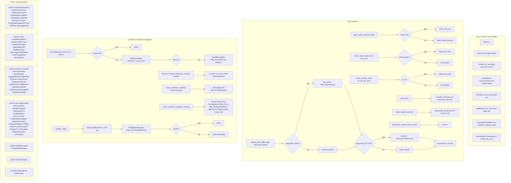

# Tray native FFI layer and helpers

Source path: `true-tick/apps/true-tick/src/tray/native.rs`

## Notes

- `wide` always appends one nul terminator and never interior nuls, matching the Win32 `LPCWSTR` contract for every call site in the tray.
- `scale_logical` rounds to nearest with the plus 95 half-step on a 96 DPI baseline and saturates on multiply so extreme DPI values cannot wrap.
- `popup_track_flags` only overrides horizontal alignment on a right-edge taskbar and vertical alignment on a bottom-edge taskbar, leaving caller flags intact otherwise.
- `show_unclean_shutdown_warning` spawns a thread because it runs before the message loop exists, so the modal box cannot block startup.
- `app_create_params` treats a null `CREATESTRUCT` pointer as a null create-params answer, keeping `WM_CREATE` handling panic free on synthetic messages.
- `destroy_created_diagnostic_controls` tolerates null entries and partial creation lists, matching the diagnostic window rollback path that passes only the controls built so far.
- `taskbar_edge` returns `None` when `SHAppBarMessage` fails so menu placement falls back to caller flags instead of guessing an edge.
