# Tray power reconciliation and debounce

Source path: `true-tick/apps/true-tick/src/tray/power.rs`

```mermaid
flowchart TD
    subgraph DEBOUNCE["Debounce Teardown"]
        D0["kill_power_debounce_timer app"] --> D1{"power_debounce_active"}
        D1 -->|no| D2["return"]
        D1 -->|yes| D3["clear active flag and target state"]
        D3 --> D4{"tray_icon hwnd"}
        D4 -->|some| D5["KillTimer POWER_DEBOUNCE_TIMER_ID"]
        D4 -->|none| D6["record power.debounce.suppressed reason=shutdown_teardown"]
        D5 --> D6
    end

    subgraph TRANSITION["Power Change Entry"]
        T0["release_for_power_change app"] --> T1["record power.transition current state"]
        T1 --> T2["refresh_timing_observation"]
        T2 --> T3["apply_power_reconciliation"]
    end

    subgraph RESUME["resume_on_ac_applies predicate"]
        R0["auto_resume and pending and power Ac and ownership Released"] --> R1{"all four true"}
        R1 -->|yes| R2["true, resume applies"]
        R1 -->|no| R3["false"]
    end

    subgraph RECONCILE["apply_power_reconciliation"]
        A0["apply_power_reconciliation app"] --> A1{"pause active"}
        A1 -->|yes| A2["record policy.power_reconciliation.suppressed reason=pause_active then queue_intent Release"]
        A1 -->|no| A3["read power, automatic, ownership"]
        A3 --> A4{"resume_on_ac_applies"}
        A4 -->|yes| A5["clear pending_resume_on_ac, record power_resume_applied, queue_intent Acquire"]
        A4 -->|no| A6["power_reconciliation automatic power ownership battery_lockout"]
        A6 --> A7{"action"}
        A7 -->|Acquire| A8["apply_policy"]
        A7 -->|ReleaseBlocked| A9["release_for_policy with reason by power state"]
        A9 --> A9A["Battery gives BatteryRestricted, BatterySaver gives BatterySaverRestricted, Unknown gives PowerUnknown, Ac unreachable"]
        A7 -->|ShowStopped| A10["show_ownership_status Stopped"]
        A7 -->|PreserveOwned| A10
        A7 -->|PreserveUncertain| A11{"uncertain_recovery_attempts_acquire automatic power"}
        A11 -->|yes| A12["guarded_release settles uncertain ownership target Stopped"]
        A12 --> A13{"settle ok and ownership Released"}
        A13 -->|yes| A8
        A13 -->|no| A14["record uncertain_unsettled fallback stopped then show_ownership_status Stopped"]
        A11 -->|no| A10
    end
```

## Notes

- `apply_power_reconciliation` short circuits to a `Release` intent while a pause is active, so power changes never reacquire timing underneath a user pause.
- `resume_on_ac_applies` requires all four conditions: the config flag, a stored pending flag, observed `Ac` power, and `Released` ownership. The pending flag is set by `release_for_policy` when a power restriction forces a release.
- `ReleaseBlocked` maps the power state to a policy reason, and the `Ac` arm is `unreachable!` because the reconciliation table never selects `ReleaseBlocked` on AC power.
- `PreserveUncertain` first tries a `guarded_release` to settle ambiguous ownership, then reacquires through `apply_policy` only when the settle succeeded and ownership reads `Released`. An unsettled result falls back to showing `Stopped`.
- `kill_power_debounce_timer` records `power.debounce.suppressed` with `reason=shutdown_teardown` so teardown suppressions are distinguishable from policy cancellations in the diagnostic chain.
- `power_debounce_target_state` is cleared on teardown so a re-armed debounce cannot inherit a stale target from a prior observation.
