# Tray quit safety decision

Source path: `true-tick/apps/true-tick/src/tray/quit.rs`

```mermaid
flowchart TD
    subgraph TYPES["Decision Types"]
        Y1["QuitDecision ExitNormally or RequireSafetyDialog reason"]
        Y2["QuitDialogDecision StopAndQuit or Cancel"]
        Y3["QuitWarningResult decision, message_box_result, dialog_shown"]
        Y4["QuitSafetyReason OwnedActive, OwnershipUncertain, TimingNotSettled"]
    end

    subgraph DECIDE["Decision Ladder"]
        Q0["quit_decision app"] --> Q1["quit_decision_for_handoff lifecycle_status, ownership, handoff is_some"]
        Q1 --> Q2{"handoff active"}
        Q2 -->|yes| Q3{"ownership Released"}
        Q3 -->|yes| Q4["ExitNormally"]
        Q3 -->|no| Q5["RequireSafetyDialog TimingNotSettled"]
        Q2 -->|no| Q6["quit_decision_for status ownership"]
        Q6 --> Q7{"ownership"}
        Q7 -->|Owned| Q8["RequireSafetyDialog OwnedActive"]
        Q7 -->|Uncertain| Q9["RequireSafetyDialog OwnershipUncertain"]
        Q7 -->|Released| Q10{"status in Running, Starting, Stopping, Pending, Degraded, Unverified"}
        Q10 -->|yes| Q11["RequireSafetyDialog TimingNotSettled"]
        Q10 -->|no| Q12["ExitNormally"]
    end

    subgraph DIALOG["Warning Dialog"]
        W0["quit_warning_text reason"] --> W1{"reason"}
        W1 -->|OwnershipUncertain| W2["could not verify timing released, keep open and retry cleanup"]
        W1 -->|OwnedActive or TimingNotSettled| W3["currently controlling timer resolution, stop timing and quit"]
        W4["show_quit_warning hwnd reason"] --> W5["wide title and warning text"]
        W5 --> W6["MessageBoxW MB_YESNO or MB_ICONWARNING or MB_DEFBUTTON2"]
        W6 --> W7["quit_warning_result Some result"]
        W7 --> W8["message_box_decision result"]
        W8 --> W9{"result equals IDYES"}
        W9 -->|yes| W10["StopAndQuit"]
        W9 -->|no| W11["Cancel"]
        W7 --> W12["dialog_shown = result not 0"]
    end
```

## Notes

- The handoff check runs before the ownership ladder. A pending handoff with `Released` ownership exits cleanly because release already settled, while any other handoff state forces the `TimingNotSettled` dialog.
- `OwnershipUncertain` gets its own reason string so the dialog offers a keep-open retry path instead of the destructive stop-and-quit wording.
- `MB_DEFBUTTON2` makes `No` the default button, so an accidental Enter press cancels rather than quitting under uncertainty.
- `quit_warning_result` treats a `None` or zero `MessageBoxW` result as `dialog_shown = false`, which callers use to distinguish a dismissed dialog from one that never appeared.
- `message_box_decision` maps only `IDYES` to `StopAndQuit`. Every other result, including `IDNO` and dialog failure codes, resolves to `Cancel`.
- `quit_decision_for` is separated from `quit_decision` so tests can drive the pure decision table without constructing an `App`.
