# Tray reset cleanup filesystem wipe

Source path: `true-tick/apps/true-tick/src/tray/reset.rs`

```mermaid
flowchart TD
    subgraph REPORT["ResetCleanup Report"]
        C1["log_entries_removed usize"]
        C2["log_entries_failed usize"]
        C3["config_removed bool"]
        C4["session_marker_removed bool"]
    end

    subgraph PRIMITIVES["File Primitives"]
        P0["remove_file_if_present path"] --> P1{"fs remove_file"}
        P1 -->|Ok| P2["Ok true"]
        P1 -->|Err NotFound| P3["Ok false"]
        P1 -->|Err other| P4["Err error"]
        P5["clear_directory_contents directory"] --> P6{"read_dir"}
        P6 -->|Err| P7["return 0 removed, 0 failed"]
        P6 -->|Ok entries| P8["for each flattened entry"]
        P8 --> P9{"file_type is_dir"}
        P9 -->|yes| P10["remove_dir_all path"]
        P9 -->|no or unknown| P11["remove_file path"]
        P10 --> P12{"outcome"}
        P11 --> P12
        P12 -->|Ok| P13["removed plus 1"]
        P12 -->|Err| P14["failed plus 1"]
    end

    subgraph ORCHESTRA["reset_cleanup"]
        Z0["reset_cleanup log_dir state_dir config_path"] --> Z1["session_marker = session_marker_path state_dir"]
        Z1 --> Z2["remove_file_if_present marker, unwrap_or false"]
        Z2 --> Z3["clear_directory_contents log_dir"]
        Z3 --> Z4["remove_file_if_present config_path, unwrap_or false"]
        Z4 --> Z5["ResetCleanup report"]
    end
```

## Notes

- `remove_file_if_present` maps `ErrorKind::NotFound` to `Ok(false)` rather than an error, so reset works against partially populated directories without special casing.
- `clear_directory_contents` returns a `(removed, failed)` pair and never the directory itself, so a log dir wipe leaves the containing folder in place for the session to keep writing into.
- Entries whose `file_type` query fails are treated as files and attempted with `remove_file`, keeping the failure counted instead of silently skipped.
- `reset_cleanup` removes the session marker first through `session_marker_path` on the state directory, which is separate from the log directory, so the tombstone deletion is always attempted even when the log dir is missing or empty.
- Both `unwrap_or(false)` calls collapse `Err` into `false` for the report, so IO failures on single files report as not removed rather than aborting the whole cleanup.
- `clear_directory_contents` also swallows `read_dir` errors entirely with a zero-zero return, matching the expectation that reset may run before the log directory exists.
