# Tray schedule duration actions and timers

Source path: `true-tick/apps/true-tick/src/tray/schedule.rs`

```mermaid
flowchart TD
    subgraph MANUAL["Manual Commands"]
        M0["manual_start app"] --> M1["record tray.command start and lifecycle.start_request then queue_intent Acquire manual"]
        M2["manual_stop app"] --> M3["clear pending_resume_on_ac, record tray.command stop and lifecycle.stop_request, queue_intent Release manual"]
    end

    subgraph SCHEDULE["schedule_duration_action"]
        S0["schedule_duration_action app action duration"] --> S1["capture now, replacing_pause flag"]
        S1 --> S2{"pause.current exists"}
        S2 -->|yes| S3["record duration.schedule.replacement with previous action and timing snapshot"]
        S2 -->|no| S4["cancel_duration_timer"]
        S3 --> S4
        S4 --> S5["pause.schedule action duration now"]
        S5 --> S6["current = Started or Replaced current"]
        S6 --> S7["scheduled_operation = app.operation, record schedule and deferred policy"]
        S7 --> S8{"arm_duration_timer"}
        S8 -->|false| S9["cancel pause, clear scheduled_operation, record Failed, tray_status Error, publish, return"]
        S8 -->|true| S10["begin_schedule_display_timer, record scheduled result"]
        S10 --> S11{"replacing_pause and action not Pause"}
        S11 -->|yes| S12["show_ownership_status Stopped"]
        S11 -->|no| S13{"action Pause"}
        S12 --> S13
        S13 -->|yes| S14["tray_status Pausing, publish, queue_intent Release duration pause"]
        S13 -->|no| S15["publish"]
        S14 --> S16{"menu_active"}
        S15 --> S16
        S16 -->|yes| S17["refresh_popup_menu"]
    end

    subgraph PRESET["schedule_preset_action"]
        PR0["schedule_preset_action app action preset_index"] --> PR1{"presets get index"}
        PR1 -->|none| PR2["record duration.schedule.preset result=missing and return"]
        PR1 -->|some preset| PR3["schedule_duration_action"]
    end

    subgraph CANCEL["cancel_scheduled_action"]
        C0["cancel_scheduled_action app"] --> C1{"pause.current"}
        C1 -->|none| C2["record duration.cancel noop no_scheduled_action, refresh menu if active, return"]
        C1 -->|some previous| C3["record cancel request and timing"]
        C3 --> C4["cancel_duration_timer then kill_schedule_display_timer"]
        C4 --> C5["pause.cancel expect scheduled, clear scheduled_operation"]
        C5 --> C6["record duration.cancel Cancelled"]
        C6 --> C7["refresh_power_for_duration cancel then apply_power_reconciliation"]
        C7 --> C8{"menu_active"}
        C8 -->|yes| C9["refresh_popup_menu"]
    end

    subgraph TIMERS["Timer Helpers"]
        T0["duration_timer_id generation"] --> T1["DURATION_TIMER_ID_BASE plus generation and MASK"]
        T2["cancel_duration_timer app"] --> T3{"duration_timer_id"}
        T3 -->|none| T4["clear generation, return"]
        T3 -->|some id| T5["clear id and generation then KillTimer on tray hwnd"]
        T5 --> T6{"KillTimer 0"}
        T6 -->|yes| T7["record native.KillTimer.duration.error Failed with GetLastError"]
        T8["begin_schedule_display_timer app"] --> T9{"already active"}
        T9 -->|yes| T10["return"]
        T9 -->|no| T11{"tray hwnd"}
        T11 -->|none| T12["record display_timer unavailable tray_window_missing"]
        T11 -->|some| T13["SetTimer SCHEDULE_DISPLAY_TIMER_ID SCHEDULE_DISPLAY_INTERVAL_MS"]
        T13 --> T14{"result 0"}
        T14 -->|yes| T15["record SetTimer error Failed"]
        T14 -->|no| T16["schedule_display_timer_active = true"]
        T17["kill_schedule_display_timer app"] --> T18{"active"}
        T18 -->|no| T19["return"]
        T18 -->|yes| T20["clear flag then KillTimer"]
        T21["handle_schedule_display_timer app"] --> T22{"pause.active"}
        T22 -->|yes| T23["publish"]
        T22 -->|no| T24["kill_schedule_display_timer"]
        T25["arm_duration_timer app"] --> T26{"pause.deadline"}
        T26 -->|none| T27["return false"]
        T26 -->|some deadline| T28{"tray hwnd"}
        T28 -->|none| T29["record timer unavailable, return false"]
        T28 -->|some| T30["timer_id from generation, remaining saturating"]
        T30 --> T31["SetTimer timer_id timer_interval_ms remaining"]
        T31 --> T32{"result 0"}
        T32 -->|yes| T33["record error Failed, cancel pause, kill display timer, clear ids, tray_status Error, publish, return false"]
        T32 -->|no| T34["store id and generation, record armed, return true"]
    end

    subgraph EXECUTE["execute_scheduled_action"]
        E0["execute_scheduled_action app action"] --> E1{"scheduled_operation"}
        E1 -->|some parent| E2["begin_child_operation Timer"]
        E1 -->|none| E3["begin_operation Timer"]
        E2 --> E4["record duration.deadline and timing"]
        E3 --> E4
        E4 --> E5{"action kind"}
        E5 -->|Start| E6["refresh_power_for_duration then decide PolicyInput enabled true"]
        E6 --> E7{"status Requested"}
        E7 -->|yes| E8{"ownership Released"}
        E8 -->|yes| E9["record acquire_intent_queued then queue_intent Acquire"]
        E8 -->|no| E10["record noop ownership then show_ownership_status Stopped"]
        E7 -->|no| E11["record suppressed blocked then release_for_policy decision.reason"]
        E5 -->|Stop| E12{"ownership Released"}
        E12 -->|yes| E13["record noop already_released then show_ownership_status Stopped"]
        E12 -->|no| E14["guarded_release duration stop deadline then record result"]
        E5 -->|Pause| E15["record pause.expired resume_and_reconcile then refresh_power then reconcile"]
        E9 --> E16{"action Start or Stop"}
        E10 --> E16
        E11 --> E16
        E13 --> E16
        E14 --> E16
        E15 --> E16
        E16 -->|yes| E17{"timing_verified"}
        E17 -->|Start| E18["owned and verification Verified or FinerThanRequested"]
        E17 -->|Stop| E19["released and handoff none"]
        E18 --> E20{"verified"}
        E19 --> E20
        E20 -->|yes| E21["record_verification Completed schedule.action.verify"]
        E20 -->|no| E22["record_verification Unverified schedule.action.verify"]
        E16 -->|no| E23{"handoff_operation none"}
        E21 --> E23
        E22 --> E23
        E23 -->|yes| E24["finish_operation Completed"]
    end

    subgraph DISPATCH["handle_duration_timer"]
        H0["handle_duration_timer app timer_id"] --> H1{"timer_id equals duration_timer_id"}
        H1 -->|no| H2["record ignored stale_timer"]
        H1 -->|yes| H3["generation = duration_timer_generation or 0"]
        H3 --> H4["pause.timer_event generation now"]
        H4 --> H5{"CoordinatorTimerEvent"}
        H5 -->|Early| H6["record early then arm_duration_timer rearm"]
        H5 -->|Expired action| H7["cancel_duration_timer, kill display timer, pause.cancel, execute_scheduled_action"]
        H5 -->|Stale| H8["record ignored stale_generation"]
    end

    subgraph POWER["refresh_power_for_duration"]
        PW0["refresh_power_for_duration app source"] --> PW1["record native.GetSystemPowerStatus.call sanitized"]
        PW1 --> PW2["observation.refresh_power"]
        PW2 --> PW3["record power.observation.raw and duration.power_observation with previous and current"]
    end
```

## Notes

- `duration_timer_id` folds the generation into the timer id through `DURATION_TIMER_ID_BASE` plus the masked generation, so a stale `WM_TIMER` from a superseded schedule is rejected by the `handle_duration_timer` id check before the generation check ever runs.
- `handle_duration_timer` ignores `Early` events by rearming through `arm_duration_timer`, and ignores `Stale` events outright, so only the live generation can trigger `execute_scheduled_action`.
- On `Start` expiry the policy decision is re-evaluated at the deadline through `decide` with `enabled=true`, so a schedule armed under permissive power cannot fire past a battery restriction that appeared while waiting.
- The verification record for `Start` and `Stop` lands on `schedule.action.verify` with `Completed` or `Unverified`, and `Pause` expiry never emits one because the match arm returns false for the pause variant.
- `execute_scheduled_action` finishes the diagnostic operation only when `handoff_operation` is none, because a pending handoff owns the operation context until `handle_handoff_timer` resolves it.
- A failed `arm_duration_timer` inside `schedule_duration_action` cancels the pause coordinator entry and drops `scheduled_operation` so no orphan schedule survives a `SetTimer` failure.
- `schedule_preset_action` records `result=missing` for an out-of-range index rather than panicking, matching menu paths that may hold a stale index after preset edits.
- `kill_schedule_display_timer` and `cancel_duration_timer` both tolerate a missing tray window, clearing their tracking flags before attempting `KillTimer` so teardown never leaves stale bookkeeping.
