# Tray status heartbeat and degradation

Source path: `true-tick/apps/true-tick/src/tray/status.rs`

```mermaid
flowchart TD
    subgraph KILL["kill_heartbeat_timer"]
        K0["kill_heartbeat_timer app"] --> K1{"tray_icon hwnd"}
        K1 -->|some| K2["KillTimer HEARTBEAT_TIMER_ID"]
        K1 -->|none| K3["skip KillTimer"]
        K2 --> K4["last_heartbeat_fire = None"]
        K3 --> K4
    end

    subgraph HEARTBEAT["handle_heartbeat_timer"]
        H0["handle_heartbeat_timer app"] --> H1["heartbeat.kick"]
        H1 --> H2["elapsed_ms = now minus last_heartbeat_fire or 0"]
        H2 --> H3["lateness_ms = elapsed minus HEARTBEAT_INTERVAL_MS saturating"]
        H3 --> H4{"watchdog_stall_events swap 0 greater 0"}
        H4 -->|yes| H5["sample = lateness max STALL_THRESHOLD_MS"]
        H4 -->|no| H6["sample = lateness"]
        H5 --> H7["last_heartbeat_fire = now, responsiveness.observe sample"]
        H6 --> H7
        H7 --> H8{"responsiveness state Degraded and not already degraded"}
        H8 -->|yes| H9["responsiveness_degraded = true, record responsiveness.degraded baseline and worst"]
        H9 --> H10{"not responsiveness_notified"}
        H10 -->|yes| H11["responsiveness_notified = true, show_balloon slow system responsiveness"]
        H10 -->|no| H12["publish"]
        H11 --> H12
        H8 -->|no| H13{"not degraded and was degraded"}
        H13 -->|yes| H14["clear degraded and notified flags, record responsiveness.recovered, publish"]
        H13 -->|no| H15["done"]
    end

    subgraph PUBLISH["published_status mapping"]
        P0["published_status base degraded"] --> P1{"degraded and base Running or Stopped or Paused"}
        P1 -->|yes| P2["TrayStatus::Degraded"]
        P1 -->|no| P3["base unchanged"]
    end
```

## Notes

- `handle_heartbeat_timer` both kicks the watchdog heartbeat and feeds the responsiveness tracker, so a wedged pump shows as watchdog stall while a slow but live pump shows as `Degraded`.
- When `watchdog_stall_events` is nonzero, the sample is floored at `STALL_THRESHOLD_MS` so a single stalled delivery guarantees a degraded observation instead of being averaged away.
- `lateness_ms` subtracts `HEARTBEAT_INTERVAL_MS` with `saturating_sub`, so an on-time or early fire contributes zero rather than a negative.
- The balloon notification fires only once per degradation episode through `responsiveness_notified`, and the flag resets on recovery so a later episode can notify again.
- `published_status` only overlays `Degraded` on top of `Running`, `Stopped`, or `Paused`, so real block, error, and transitional states are never masked by responsiveness.
- `kill_heartbeat_timer` clears `last_heartbeat_fire` unconditionally so the first fire after a restart measures a clean zero elapsed rather than a huge stale delta.
