# Tray surface icon lifecycle

Source path: `true-tick/apps/true-tick/src/tray/surface.rs`

```mermaid
flowchart TD
    subgraph REMOVE["remove_tray_icon"]
        R0["remove_tray_icon app"] --> R1{"tray_icon take"}
        R1 -->|some icon| R2["Shell_NotifyIconW NIM_DELETE icon"]
        R2 --> R3["record native.Shell_NotifyIconW.delete result and raw_status"]
        R1 -->|none| R4["skip delete"]
        R3 --> R5["clear_icon_cache"]
        R4 --> R5
    end

    subgraph RESTORE["restore_tray_icon"]
        T0["restore_tray_icon hwnd app"] --> T1["record tray.taskbar_created action=restore"]
        T1 --> T2{"NotifyIconData::new lifecycle_status timing_values pause block_reason"}
        T2 -->|Err raw_error| T3["record tray_icon.create.error Failed, tray_icon = None, publish_tray_icon, return"]
        T2 -->|Ok icon| T4["Shell_NotifyIconW NIM_ADD icon"]
        T4 --> T5["add_error = GetLastError if result 0 else 0"]
        T5 --> T6{"native_bool_result Failed"}
        T6 -->|yes| T7["record Shell_NotifyIconW.add.error Failed, tray_icon = None, publish_tray_icon, return"]
        T6 -->|no| T8["tray_icon = Some icon, last_publication = None"]
        T8 --> T9["publish_tray_icon"]
    end

    subgraph PUBLISH["publish_tray_icon"]
        P0["publish_tray_icon app"] --> P1["app.publish"]
    end
```

## Notes

- `remove_tray_icon` takes the icon out of `app.tray_icon` before calling `NIM_DELETE`, so a failed delete cannot leave a stale registration that a later publish would trust.
- `clear_icon_cache` runs on every removal path, including the no-icon path, because cached `HICON` handles must not outlive the registration that referenced them.
- `restore_tray_icon` records `tray.taskbar_created` before any work so the diagnostic chain sees the shell restart even when icon creation fails immediately.
- Both failure arms in `restore_tray_icon` set `app.tray_icon = None` before publishing, so the tier machine sees the surface as absent rather than reading a half-restored registration.
- `last_publication` is cleared after a successful re-add so the next publish writes a fresh `NIM_MODIFY` instead of diffing against pre-restart state.
- `GetLastError` is sampled immediately after `NIM_ADD` on the same thread, and only when the add returned zero, so the recorded `raw_status` always belongs to that call.
