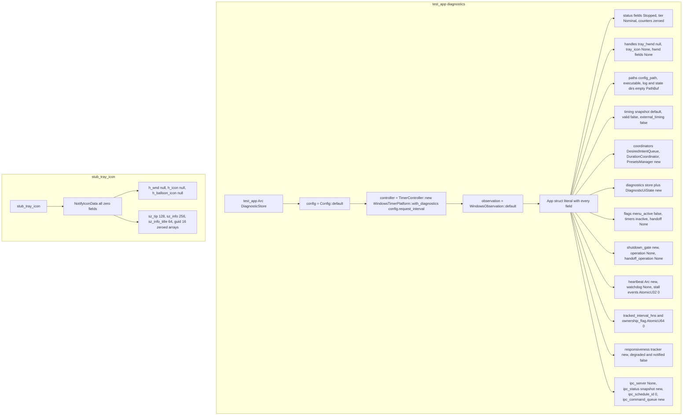

# Tray test_harness App factory

Source path: `true-tick/apps/true-tick/src/tray/test_harness.rs`

## Notes

- The module is `#[cfg(test)]` only, so `test_app` and `stub_tray_icon` never compile into the release binary.
- `test_app` wires the real `WindowsTimerPlatform` with diagnostics rather than a mock, so tests exercise the actual controller path while still capturing diagnostic events through the injected store.
- Every `App` field is initialized explicitly in one literal, so adding a field to `App` without updating the harness is a compile error rather than a silent default.
- `stub_tray_icon` returns an all-zero `NotifyIconData`, which is sufficient for code paths that only read `h_wnd` or store the struct, and deliberately avoids fabricating a live shell registration.
- Atomics (`pending_anomalies`, `watchdog_stall_events`, `tracked_interval_hns`, `ownership_flag`, `last_persisted_event_sequence`) are constructed fresh per call so tests cannot leak counter state into each other.
