# Tray tier policy engine and ownership spine

Source path: `true-tick/apps/true-tick/src/tray/tier.rs`

```mermaid
flowchart TD
    subgraph ENTRY["Policy Entry Points"]
        E0["reconcile app"] --> E1["record policy.recalculate then refresh_timing_observation then apply_policy"]
        E2["apply_policy app"] --> E3["decide PolicyInput enabled true, eligible true, power, battery_lockout"]
        E3 --> E4["record policy.evaluation"]
        E4 --> E5{"pause_active"}
        E5 -->|yes| E6["record pause_suppressed, intent Release"]
        E5 -->|no| E7{"pause.current scheduled"}
        E7 -->|some Start or Stop| E8{"decision Requested"}
        E8 -->|no| E9["record duration.suppressed then release_for_policy reason, return"]
        E8 -->|yes| E10["record duration.deferred, show_ownership_status Stopped, return"]
        E7 -->|some Pause| E11["intent Release"]
        E7 -->|none| E12{"acquisition_is_allowed automatic power lockout"}
        E12 -->|yes| E13["intent Acquire"]
        E12 -->|no| E14["intent Release"]
        E6 --> E15{"handoff pending"}
        E11 --> E15
        E13 --> E15
        E14 --> E15
        E15 -->|yes| E16["record recalculate.deferred"]
        E16 --> E17["queue_intent intent policy reason"]
        E15 -->|no| E17
    end

    subgraph INTENT["Intent Queue Processing"]
        Q0["queue_intent app intent source"] --> Q1["desired_intent.request, record lifecycle.desired_intent"]
        Q1 --> Q2{"handoff is_some"}
        Q2 -->|yes| Q3["tray_status Pausing or Stopping, publish, return"]
        Q2 -->|no| Q4["process_desired_intent"]
        P0["process_desired_intent app"] --> P1{"handoff is_some"}
        P1 -->|yes| P2["tray_status Pausing or Stopping, publish, return"]
        P1 -->|no| P3{"desired_intent.take"}
        P3 -->|none| P4["return"]
        P3 -->|Acquire| P5{"pause_active"}
        P5 -->|yes| P6["record acquire.suppressed"]
        P6 --> P7{"ownership Released"}
        P7 -->|yes| P8["tray_status Paused, publish, arm_duration_timer"]
        P7 -->|no| P9["return"]
        P5 -->|no| P10["decide PolicyInput"]
        P10 --> P11{"status Requested"}
        P11 -->|yes| P12["acquire_timer"]
        P11 -->|no| P13["release_for_policy reason"]
        P3 -->|Release| P14{"tray_status Starting"}
        P14 -->|yes| P15["re-queue Release, record release_queued acquisition_verification_pending"]
        P14 -->|no| P16{"ownership Owned or Uncertain"}
        P16 -->|yes| P17["guarded_release desired intent target Paused or Stopped"]
        P17 -->|Err| P18["record ownership.release.caller_failed"]
        P16 -->|no| P19["tray_status Paused or Stopped, publish, arm_duration_timer if pause"]
    end

    subgraph ACQUIRE["acquire_timer"]
        A0["acquire_timer app"] --> A1{"ownership Released"}
        A1 -->|no| A2["show_ownership_status Stopped, return"]
        A1 -->|yes| A3{"tier_allows_high_resolution"}
        A3 -->|no| A4["record tier.acquisition_blocked, tray_status Paused or Stopped, publish, return"]
        A3 -->|yes| A5["tray_status Starting, publish, record ownership.acquire.request"]
        A5 --> A6["controller.start"]
        A6 --> A7["sync_timing_snapshot, set snapshot_valid and invalid_interval flags"]
        A7 --> A8{"start_result"}
        A8 -->|Ok Verified or FinerThanRequested| A9["record verification.result and ownership.changed owned, status Running"]
        A8 -->|Ok other| A10["record verification.result, status Unverified"]
        A8 -->|Err| A11["record acquire.error Failed, status Unsupported or Error"]
        A9 --> A12["start ok clears last_block_reason"]
        A10 --> A12
        A11 --> A12
        A12 --> A13{"status Running"}
        A13 -->|yes| A14["running_since = now"]
        A13 -->|no| A15["running_since = None"]
        A14 --> A16["tray_status status, publish"]
        A15 --> A16
        A16 --> A17{"desired_intent pending"}
        A17 -->|yes| A18["process_desired_intent"]
    end

    subgraph ANOMALY["drain_anomaly_producers"]
        D0["drain_anomaly_producers app"] --> D1["pending_anomalies swap 0"]
        D1 --> D2{"pending greater 0"}
        D2 -->|yes| D3["take reasons list, unhandled_anomalies saturating_add, record tier.anomaly.observed per reason"]
        D2 -->|no| D4["watchdog stall_episodes"]
        D3 --> D4
        D4 --> D5{"episodes greater last_watchdog_episodes"}
        D5 -->|yes| D6["add delta, record anomaly watchdog_stall_episode"]
        D5 -->|no| D7["scan diagnostics for storage failure events max sequence"]
        D6 --> D7
        D7 --> D8{"sequence greater consumed_log_write_failures"}
        D8 -->|yes| D9["add delta count, record anomaly log_write_failure"]
        D8 -->|no| D10["caught_dispatch_panics"]
        D9 --> D10
        D10 --> D11{"panics greater consumed_dispatch_panics"}
        D11 -->|yes| D12["add delta, record anomaly caught_panic"]
    end

    subgraph TIEREVAL["refresh_operating_tier"]
        V0["refresh_operating_tier app"] --> V1["drain_anomaly_producers"]
        V1 --> V2["current_floor_hns from MetrologyDegraded"]
        V2 --> V3["nominally_recoverable = tray_icon some and zero rejects and zero anomalies"]
        V3 --> V4["evaluate_tier with TierContext"]
        V4 --> V5{"leaving SurfaceDegraded"}
        V5 -->|yes| V6["KillTimer SURFACE_RECOVERY_TIMER_ID on tray_hwnd"]
        V5 -->|no| V7{"transition"}
        V6 --> V7
        V7 -->|Stay| V8["no change"]
        V7 -->|EnterSurfaceDegraded| V9["tier SurfaceDegraded, reset attempts, due = now plus spacing, arm SetTimer"]
        V9 --> V9A["record tier.surface_recovery.armed timer_valid"]
        V7 -->|EnterMetrologyDegraded floored_hns| V10["tier MetrologyDegraded, controller.clamp_requested_interval_floor"]
        V7 -->|EnterQuiescent| V11["tier Quiescent"]
        V7 -->|Recover| V12["tier Nominal, zero counters, resync baselines, clear recovery state"]
        V8 --> V13{"transition not Stay"}
        V9A --> V13
        V10 --> V13
        V11 --> V13
        V12 --> V13
        V13 -->|yes| V14["record tier.transition"]
        V14 --> V15{"EnterQuiescent and ownership Owned"}
        V15 -->|yes| V16["record quiescent.restorative_release then guarded_release Stopped"]
    end

    subgraph SURFACE["Surface Recovery"]
        F0["service_surface_recovery app hwnd"] --> F1{"tier SurfaceDegraded"}
        F1 -->|no| F2["return"]
        F1 -->|yes| F3{"tray_icon some"}
        F3 -->|yes| F2
        F3 -->|no| F4{"recovery exhausted"}
        F4 -->|yes| F2
        F4 -->|no| F5{"recovery_due"}
        F5 -->|none| F6["set due = now plus spacing, return"]
        F5 -->|some due| F7{"now before due"}
        F7 -->|yes| F2
        F7 -->|no| F8["attempt_surface_restore"]
        F8 --> F9["advance_surface_recovery recovered"]
        G0["advance_surface_recovery app recovered"] --> G1["attempts saturating_add 1"]
        G1 --> G2{"recovered"}
        G2 -->|yes| G3["record tier.surface_recovered, clear due and attempts, KillTimer, publish"]
        G2 -->|no| G4["record tier.surface_recovery.attempt Failed"]
        G4 --> G5{"attempts ge SURFACE_RECOVERY_ATTEMPTS"}
        G5 -->|yes| G6["exhausted = true, clear due, KillTimer, record surface_recovery_exhausted, publish"]
        G5 -->|no| G7["due = now plus spacing, publish"]
        F8 --> F8A{"attempt_surface_restore"}
        F8A --> F8B["NotifyIconData::new"]
        F8B -->|Err| F8C["record create.error surface_recovery, return false"]
        F8B -->|Ok| F8D["NIM_ADD then native_bool_result"]
        F8D -->|Failed| F8E["record add.error surface_recovery, return false"]
        F8D -->|ok| F8F["tray_icon = Some, last_publication = None, true"]
    end

    subgraph RELEASE["Release Paths"]
        L0["release_for_policy app reason"] --> L1{"handoff is_some"}
        L1 -->|yes| L2["queue_intent Release policy reason, return"]
        L1 -->|no| L3["is_power_restriction check"]
        L3 --> L4{"power restriction and Owned or Uncertain"}
        L4 -->|yes| L5["pending_resume_on_ac = true, record power_resume_pending"]
        L4 -->|no| L6["map reason to released_status"]
        L5 --> L6
        L6 --> L6A["Battery and Saver and PowerUnknown and GloballyDisabled map Blocked, NoEligibleProfile and EligibleProfile map Stopped"]
        L6A --> L7{"status Blocked"}
        L7 -->|yes| L8["last_block_reason = Some reason"]
        L7 -->|no| L9["last_block_reason = None"]
        L8 --> L10{"ownership Owned or Uncertain"}
        L9 --> L10
        L10 -->|yes| L11["guarded_release policy reason source, released_status"]
        L10 -->|no| L12["tray_status released_status, publish"]
        GR0["guarded_release app source released_status"] --> GR1{"handoff is_some"}
        GR1 -->|yes| GR2["record release.repeated, Err handoff already pending"]
        GR1 -->|no| GR3["record release.request, clear external_timing and running_since"]
        GR3 --> GR4["tray_status Pausing or Stopping, publish"]
        GR4 --> GR5["controller.stop then sync_timing_snapshot"]
        GR5 --> GR6{"stop_result"}
        GR6 -->|Ok released| GR7["record ownership.changed released"]
        GR7 --> GR8{"released and boundary needs handoff"}
        GR8 -->|yes| GR9{"boundary Some"}
        GR9 -->|none| GR10["record missing_release_boundary Failed, Err"]
        GR9 -->|some| GR11{"begin_handoff"}
        GR11 -->|true| GR12["Ok released"]
        GR11 -->|false| GR13["fall through to direct settle"]
        GR8 -->|no| GR13
        GR13 --> GR14["record ownership.result handoff not_required, clear_release_boundary, sync snapshot, tray_status released_status, publish"]
        GR14 --> GR15{"pause_active"}
        GR15 -->|yes| GR16["arm_duration_timer"]
        GR15 -->|no| GR17["Ok released"]
        GR16 --> GR17
        GR6 -->|Err error| GR18["snapshot_valid false, running_since None, record release.error Failed, tray_status Unverified, publish, Err"]
    end

    subgraph STATUS["Status and Observation Helpers"]
        O0["show_ownership_status app released_status"] --> O1{"handoff is_some"}
        O1 -->|yes| O2["tray_status Pausing or Stopping, publish, return"]
        O1 -->|no| O3{"ownership"}
        O3 -->|Released and pause_active| O4["Paused"]
        O3 -->|Released| O5["released_status"]
        O3 -->|Owned| O6["Running"]
        O3 -->|Uncertain| O7["Unverified"]
        O4 --> O8["publish"]
        O5 --> O8
        O6 --> O8
        O7 --> O8
        B0["refresh_timing_observation app"] --> B1{"controller.query"}
        B1 -->|Ok observation| B2["sync snapshot valid, record timer.query.observation Completed, Some"]
        B1 -->|Err| B3["sync snapshot invalid, record timer.query.error Failed, None"]
    end

    subgraph SETTLE["probe_startup_kernel_settle"]
        K0["probe_startup_kernel_settle app"] --> K1["attempts_used = 0"]
        K1 --> K2{"attempt_startup_kernel_settle_probe attempts_used"}
        K2 -->|NotApplicable| K3["return"]
        K2 -->|Retry budget| K4["attempts_used plus 1, record settle_probe retry, sleep SETTLE_PROBE_SPACING_MS"]
        K4 --> K2
        K2 -->|Settled outcome| K5["sync snapshot valid"]
        K5 --> K6{"outcome"}
        K6 -->|Resolved freed_hns| K7["record settle_probe_restored"]
        K6 -->|ExternalClientConfirmed| K8["external_timing = true, record external_timing_confirmed"]
        K6 -->|Exhausted| K9["record settle_probe_exhausted budget spent"]
    end

    subgraph HANDOFF["Release Handoff"]
        N0["begin_handoff app boundary released_status"] --> N1["HandoffTracker::new, begin_operation Handoff, store handoff_operation"]
        N1 --> N2["cancel_duration_timer"]
        N2 --> N3{"tray_icon hwnd"}
        N3 -->|none| N4["record handoff.timeout watcher_unavailable, external_timing true, clear boundary, status Stopped or Unverified, publish, process_desired_intent, finish TimedOut, false"]
        N3 -->|some| N5["SetTimer HANDOFF_TIMER_ID HANDOFF_POLL_INTERVAL_MS"]
        N5 --> N6{"timer 0"}
        N6 -->|yes| N7["record handoff.timeout watcher_start_failed and ownership.result, external_timing true, clear boundary, publish, process_desired_intent, finish TimedOut, false"]
        N6 -->|no| N8["handoff = Some tracker, status Pausing or Stopping, record handoff.started, publish, true"]
        J0["finish_handoff_timer app"] --> J1{"tray_icon hwnd"}
        J1 -->|some| J2["KillTimer HANDOFF_TIMER_ID"]
        J2 --> J3{"result 0"}
        J3 -->|yes| J4["record KillTimer.handoff.error Failed"]
        J1 -->|none| J5["skip"]
        I0["handle_handoff_timer app"] --> I1["restore handoff_operation into operation"]
        I1 --> I2{"handoff take"}
        I2 -->|none| I3["return"]
        I2 -->|some tracker| I4["handoff = Some tracker then boundary = tracker.boundary"]
        I4 --> I5{"controller.observe_current boundary"}
        I5 -->|Ok observation| I6["sync snapshot valid, record timer.handoff.observation, effective = reported_current"]
        I5 -->|Err| I7["sync snapshot invalid, record handoff.query.error Failed, effective None"]
        I6 --> I8["tracker = handoff.take then progress = tracker.observe effective"]
        I7 --> I8
        I8 --> I9["record handoff.observation poll result"]
        I9 --> I10{"progress"}
        I10 -->|Pending| I11["handoff = Some tracker, status Pausing or Stopping, publish"]
        I10 -->|Completed| I12["finish_handoff_timer, record completed and ownership.result non_finer, clear boundary, status released_status, external_timing false, publish, process_desired_intent, finish Completed"]
        I10 -->|TimedOut| I13["finish_handoff_timer, record timeout external_or_unknown_client, clear boundary, status Stopped or Unverified, external_timing true, publish, process_desired_intent, finish TimedOut"]
        I12 --> I14{"pause_active"}
        I13 --> I14
        I14 -->|yes| I15["arm_duration_timer"]
    end
```

## Notes

- `queue_intent` and `process_desired_intent` both park the tray at `Pausing` or `Stopping` while a handoff is pending, so the queued intent is stored but not acted on until `handle_handoff_timer` resolves and re-enters `process_desired_intent`.
- A `Release` intent that arrives while `tray_status` is `Starting` is re-queued rather than dropped, because acquisition verification is still in flight and the release must run after it settles.
- `acquire_timer` bumps `kernel_rejected_requests` only on `TimerError::RequestFailed`, keeping tier escalation tied to kernel rejections rather than every error variant.
- `drain_anomaly_producers` folds four producer streams into `unhandled_anomalies`: shared pending counters, watchdog stall episodes, storage failure diagnostic sequences, and caught dispatch panics. Each uses a consumed baseline so an occurrence counts exactly once.
- `is_storage_failure_event` matches `storage.` names with `Failed` or `Suppressed` outcomes, covering both write faults and free-space suppressions.
- `refresh_operating_tier` treats `nominally_recoverable` as icon present plus zero kernel rejects plus zero anomalies. `Recover` re-zeros every anomaly baseline so the next evaluation starts clean.
- Entering `Quiescent` while owned triggers a `guarded_release` as a restorative step, and a second release during a pending handoff returns `Err("handoff already pending")` which callers log rather than propagate.
- `release_for_policy` arms `pending_resume_on_ac` only for power restrictions with ownership still held, which is the flag `resume_on_ac_applies` in `power.rs` later consumes on AC restore.
- `guarded_release` starts a handoff only when `release_needs_handoff(boundary, effective)` is true, meaning the system timer stayed finer than our boundary after release, which signals an external or unknown client still holds a request.
- `begin_handoff` failure paths converge on the same settle sequence: mark `external_timing`, clear the release boundary, publish `Stopped` or `Unverified`, process queued intents, and finish the handoff operation `TimedOut`.
- `handle_handoff_timer` polls `observe_current` at the release boundary each `WM_TIMER` tick. `Completed` clears `external_timing` while `TimedOut` sets it, and both clear the release boundary and drain the intent queue.
- `probe_startup_kernel_settle` blocks the UI thread on sleeps bounded by `SETTLE_PROBE_ATTEMPTS` and `SETTLE_PROBE_SPACING_MS` from `tick_ownership`, and runs once at startup before the pump begins.
- `report_anomaly` is `#[allow(dead_code)]` since runtime producers write through the dedicated counters, but it stays for tests driving the pending path directly.
