# tray_surface.rs

Source: `true-tick/apps/true-tick/src/tray_surface.rs`

## Diagram

```mermaid
flowchart TD
    Start["tray_surface.rs"] --> Lifecycle["lifecycle_status(status, handoff_active)"]
    Lifecycle -->|"handoff_active or Pausing"| ForceStop["Force Stopping (yellow)"]
    Lifecycle -->|"otherwise"| Keep["Keep status"]
    Keep --> SchedLife["scheduled_lifecycle_status(status, handoff_active, scheduled)"]
    SchedLife -->|"Stopped and Start scheduled"| SchedStart["ScheduledStart (yellow)"]
    SchedLife -->|"Running and Stop scheduled"| SchedStop["ScheduledStop (yellow)"]
    SchedLife -->|"otherwise"| SchedKeep["Keep status"]

    Keep --> Icon["icon_color"]
    SchedStart --> Icon
    SchedStop --> Icon
    Icon -->|"Running"| Green["Green"]
    Icon -->|"Starting, ScheduledStart, Pausing, Stopping, ScheduledStop, Paused, Pending, Degraded, Unverified"| Yellow["Yellow"]
    Icon -->|"Stopped, Blocked, Unsupported, Error"| Red["Red"]

    SchedKeep --> Tooltip["tooltip_at -> state_summary"]
    SchedStart --> Tooltip
    SchedStop --> Tooltip
    Tooltip --> ActionSummary{"ScheduledStart or ScheduledStop or Paused with Pause?"}
    ActionSummary -->|"yes"| ActionLabel["Starting in N / Stopping in N / Paused for N"]
    ActionSummary -->|"no"| StateMatch["match status"]
    StateMatch -->|"Blocked"| Block["Blocked (Battery / Battery Saver / Power unknown) or Warning"]
    StateMatch -->|"Error or Pending or Degraded or Unsupported"| Warning["True Tick: Warning"]
    StateMatch -->|"Unverified"| Unknown["True Tick: Timing unknown"]
    StateMatch -->|"Running / Starting / Pausing / Stopping / Paused / Stopped"| State["State text"]
    State --> Suffix["append effective timing suffix (verified ms or Timing unknown)"]
    Block --> Suffix
    Warning --> Suffix
    Unknown --> Suffix

    Icon --> MenuRender["menu_description(command_id)"]
    MenuRender -->|"1001"| Desc1["Request the best supported timing"]
    MenuRender -->|"1002"| Desc2["Release True Tick timing"]
    MenuRender -->|"1005 or 1006"| Desc3["Launch True Tick when you sign in"]
    MenuRender -->|"1007 or 1008"| Desc4["Request timing automatically on AC power"]
    MenuRender -->|"1009 or 1010"| Desc5["Resume timing when returning to AC power"]
    MenuRender -->|"1027 or 1028"| Desc6["Restrict timing requests on DC power"]
    MenuRender -->|"1060"| Desc7["Clear all data and restart"]
    MenuRender -->|"1061"| Desc8["Reset settings to factory defaults"]
    MenuRender -->|"1050"| Desc9["Open status and session logs"]
    MenuRender -->|"1051"| Desc10["Open True Tick on GitHub"]
    MenuRender -->|"1101 to 1106"| Desc11["Schedule a bounded timing action"]
    MenuRender -->|"start in / stop in / pause for ids"| Desc12["Start in N / Stop in N / Pause for N"]
    MenuRender -->|"1004"| Desc13["Stop safely and quit"]

    Icon --> Enable["menu_command_is_enabled_with_pause"]
    Enable -->|"1001 acquire"| En1["Disabled while Running, Starting, Stopping, or Paused"]
    Enable -->|"1002 stop"| En2["Enabled while Running, Starting, ScheduledStop, or Unverified"]
    Enable -->|"1005 or 1006"| En3["Enabled by inverted startup_enabled"]
    Enable -->|"1007 or 1008"| En4["Enabled by inverted automatic"]
    Enable -->|"1009 or 1010"| En5["Enabled by inverted auto_resume_on_ac"]
    Enable -->|"1027 or 1028"| En6["Enabled by inverted battery_lockout"]
    Enable -->|"1025 or 1026"| En7["Enabled only when schedule_active"]
    Enable -->|"1050, 1051, 1106, 1004, 1060, 1061"| En8["Always enabled"]
    Enable -->|"start in / stop in / pause for ids"| En9["Always enabled"]
    Enable -->|"preset ids"| En10["Enabled when a preset maps"]
```

## Notes

- `lifecycle_status` forces `TrayStatus::Stopping` whenever `handoff_active` is true or the status is `Pausing`, which is why the tray shows yellow while a handoff is pending even if a stop error is reported.
- `scheduled_lifecycle_status` maps `Stopped` plus a scheduled `Start` to `ScheduledStart` and `Running` plus a scheduled `Stop` to `ScheduledStop`, but it never overrides a handoff-forced status.
- `icon_color` classifies `Running` as green, a broad set of in-flight states as yellow, and `Stopped`, `Blocked`, `Unsupported`, and `Error` as red.
- The tooltip is built by `state_summary`, which returns early strings for `Error`, `Blocked` with an empty reason label, `Pending` or `Degraded` or `Unsupported`, and `Unverified`.
- `block_reason_label` names only `Battery`, `Battery Saver`, or `Power unknown` and returns an empty label for any other `PolicyReason`, causing the tooltip to fall back to the generic warning.
- Blocked tooltips keep the effective timing suffix after the `Blocked (label)` text, and verified running tooltips show the millisecond effective timing value.
- `state_label` and `state_menu_label` render `Stopping, handoff` when `timing.handoff_pending` is set, and scheduled or paused states use the live remaining duration.
- `menu_description` returns a short hover text per command id, with an empty result for unmatched ids, and the durations, presets, and status submenus each get dedicated description strings.
- `menu_command_is_enabled_with_pause` enables acquire only when not running, starting, stopping, or paused, and enables stop only for running, starting, `ScheduledStop`, or `Unverified`.
- Toggle commands are enabled against the inverted current flag, so `1005` enables when auto-start is off, and `1007` enables when auto-time is off.
- `CANCEL_SCHEDULED` and `CANCEL_PAUSE` are enabled only while a schedule is active, while logs, github, presets, quit, clear, and reset commands are always enabled.
- Read-only status menu items are always disabled and expose state, timing, running duration, next action, and ownership details with their own command ids.
- `HandoffTracker::observe` marks the handoff completed once the effective timing reaches the boundary, else it advances polls and returns `TimedOut` at `HANDOFF_MAX_POLLS`.
