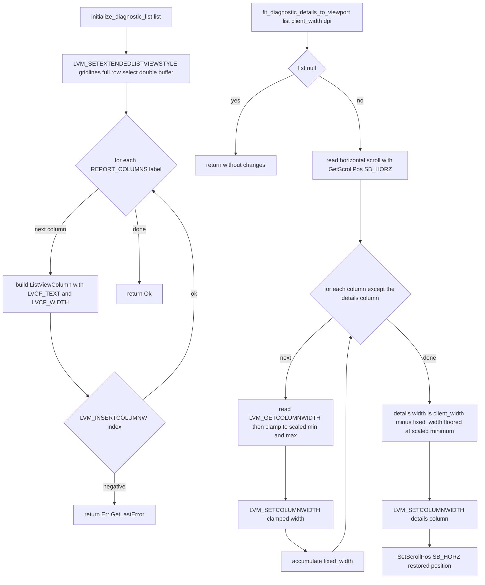

# Diagnostic Grid Initialization and Detail Fit in diagnostic_grid.rs

Source path: `true-tick/apps/true-tick/src/ui/diagnostic_grid.rs`

## Notes

- `initialize_diagnostic_list` applies the extended style once and then inserts one column per `REPORT_COLUMNS` entry, using `DIAGNOSTIC_COLUMN_WIDTHS` for each initial width.
- A column insert that returns a negative value stops the loop and returns `Err` from `GetLastError`, so a partially built list is reported rather than silently accepted.
- `fit_diagnostic_details_to_viewport` is a no-op when the list handle is null, which keeps the caller free of null checks.
- Every non details column is clamped into `DIAGNOSTIC_COLUMN_MIN_WIDTHS` and `DIAGNOSTIC_COLUMN_MAX_WIDTHS` after DPI scaling before it is written back.
- The details column is always the last `REPORT_COLUMNS` entry and receives all remaining client width, floored at its scaled minimum so it never collapses below the minimum.
- The horizontal scroll position is read before any width change and restored with `SetScrollPos` after the details column is written, so resizing does not jump the viewport.
- `diagnostic_list_style` removes `LVS_SINGLESEL` so the grid supports multi row drag selection, and the extended style adds gridlines, full row select, and double buffering.
- The display text helper `diagnostic_grid_cell_into_scratch` borrows the wide scratch buffer owned by window state so the pointer returned to `LVN_GETDISPINFO` outlives the notification.