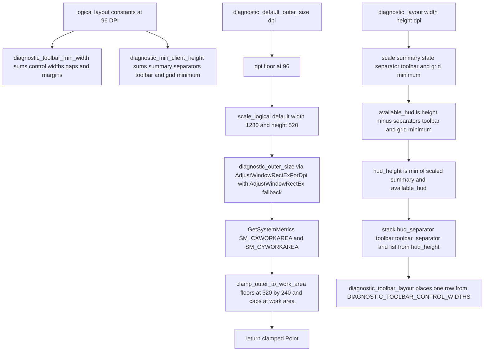

# Diagnostic Layout Geometry in diagnostic_layout.rs

Source path: `true-tick/apps/true-tick/src/ui/diagnostic_layout.rs`

## Notes

- The layout constants are logical units at 96 DPI and every consumer scales them through `scale_logical` before use, so the numbers stay DPI independent.
- `DIAGNOSTIC_TOOLBAR_CONTROL_WIDTHS` holds 12 left to right widths and is shared by `WM_CREATE` sizing and `diagnostic_toolbar_layout`, which prevents creation and layout from drifting apart.
- `diagnostic_toolbar_min_width` adds two margins, every control width, one gap per control, and the minimum message width, then scales the total at the requested DPI.
- `diagnostic_min_client_height` adds the summary, both separators, the toolbar, and the grid minimum, then scales the total at the requested DPI.
- `diagnostic_outer_size` adds the native window frame with `AdjustWindowRectExForDpi` and falls back to `AdjustWindowRectEx` when the DPI aware call is unavailable, returning the client size unchanged when both fail.
- `diagnostic_default_outer_size` floors the DPI at 96, scales the default 1280 by 520 client size, converts to an outer rectangle, and clamps the result into the work area with a 320 by 240 floor.
- `diagnostic_layout` floors the DPI at 96 and caps the summary region by `available_hud`, which is the client height minus both separators, the toolbar, and the grid minimum, so the grid always keeps its minimum height.
- The `list` rectangle takes all remaining client height below `toolbar_separator`, and every width uses `saturating_sub` with a zero floor so degenerate sizes stay non negative.
- `DiagnosticLayout` exposes `hud_state`, `summary`, `hud_separator`, `toolbar`, `toolbar_separator`, and `list`, and `DiagnosticToolbarLayout` exposes one rectangle per toolbar control plus the trailing message area.
- The window style helpers `diagnostic_window_style` and `diagnostic_window_extended_style` stay private to this module and feed only the frame math used by `diagnostic_outer_size`.