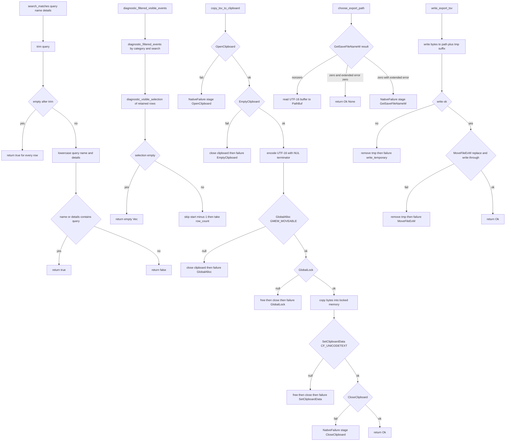

# Diagnostic Copy and Export Transfer in diagnostic_transfer.rs

Source path: `true-tick/apps/true-tick/src/ui/diagnostic_transfer.rs`

## Notes

- `search_matches` treats a missing or blank query as match all, otherwise lowercases the trimmed query and checks it against both the event name and the details.
- `diagnostic_filtered_visible_events` composes `diagnostic_filtered_events` with `diagnostic_visible_selection`, so an empty selection yields an empty vector instead of every retained row.
- The slice in `diagnostic_filtered_visible_events` uses `selection.start().saturating_sub(1)` and `take(selection.row_count())`, which converts the one based `RowSelection` to a zero based iterator offset.
- `copy_tsv_to_clipboard` allocates a moveable global block and transfers ownership to the clipboard only when `SetClipboardData` succeeds, freeing the block on every earlier failure and closing the clipboard on every path.
- `choose_export_path` maps a nonzero `GetSaveFileNameW` result to a path, a zero result with zero extended error to cancel, and a zero result with a nonzero extended error to a failure.
- `write_export_tsv` writes to a `.tmp` sibling first and then calls `MoveFileExW` with `MOVEFILE_REPLACE_EXISTING` and `MOVEFILE_WRITE_THROUGH` for an atomic replace, removing the temporary file when either step fails.
- `export_io_error` falls back to error code 1 when the underlying `std::io::Error` has no raw OS error or the value does not fit a `u32`.
- `diagnostic_transfer_source` resolves precedence as grid selection first, then range selection, then none, and the same precedence backs Ctrl C copy and export.
- The native Win32 declarations for clipboard and save dialog live in this module beside their callers, so no other module owns those handles.