# Diagnostic Window

Source path: `true-tick/apps/true-tick/src/ui/diagnostic_window.rs`

```mermaid
flowchart TD
    subgraph WIRE["file wiring"]
        W0["pub(crate) use diagnostic_grid star, diagnostic_layout star"]
        W1["imports diagnostic_transfer helpers"]
        W2["imports tray list_view_native and Win32 ffi"]
        W3["imports tick_diagnostics and tray_surface helpers"]
    end

    subgraph OPEN["open_diagnostic_window"]
        A["open_diagnostic_window"]
        A --> B{"existing window live and children ready"}
        B -- "yes" --> C["restore or normal show, foreground"]
        C --> D["request_diagnostic_refresh"]
        D --> E["return true"]
        B -- "no" --> F["clear stale state or destroy window"]
        F --> G["GetDpiForSystem, min 96"]
        G --> H["diagnostic_layout::diagnostic_default_outer_size"]
        H --> I["CreateWindowExW"]
        I --> J{"window null"}
        J -- "yes" --> K["record create_failed, return false"]
        J -- "no" --> L{"title set and children ready"}
        L -- "no" --> M["destroy, clear state, return false"]
        L -- "yes" --> N{"layout_diagnostic_controls ok"}
        N -- "no" --> M
        N -- "yes" --> O["refresh hidden window with real data"]
        O --> P["ShowWindow, verify visible, foreground"]
        P --> D
    end

    subgraph CREATE["WM_CREATE control creation"]
        CA["WM_CREATE"]
        CA --> CB["store App in GWLP_USERDATA, guard EN_CHANGE"]
        CB --> CC["create HUD state, summary, separators, toolbar controls, listview"]
        CC --> CD{"any control null"}
        CD -- "yes" --> CE["record error, destroy controls, failure"]
        CD -- "no" --> CF["set fonts, store all handles"]
        CF --> CG["diagnostic_grid::initialize_diagnostic_list columns"]
        CG --> CH{"insert column failed"}
        CH -- "yes" --> CE
        CH -- "no" --> CI["subclass list with marquee proc"]
        CI --> CJ["refresh presentation, layout controls"]
        CJ --> CK["clear init guard, return 0"]
    end

    subgraph LAYOUT["layout_diagnostic_controls"]
        LA["layout_diagnostic_controls"]
        LA --> LB["GetClientRect, GetDpiForWindow"]
        LB --> LC["diagnostic_layout::diagnostic_layout rects"]
        LC --> LD["apply_diagnostic_layout, stop on first failure"]
        LD --> LE["diagnostic_grid::fit_diagnostic_details_to_viewport"]
        LE --> LF["return layout result"]
    end

    subgraph REFRESH["refresh pipeline"]
        RA["request_diagnostic_refresh"]
        RA --> RB{"pending or refreshing"}
        RB -- "yes" --> RC["set pending, return"]
        RB -- "no" --> RD["PostMessageW WM_DIAGNOSTIC_REFRESH"]
        RD --> RE["WM_DIAGNOSTIC_REFRESH handler"]
        RE --> RF{"refreshing"}
        RF -- "yes" --> RG["return"]
        RF -- "no" --> RH["set refreshing, redraw off"]
        RH --> RI["snapshot, snapshot key, bump generation when changed"]
        RI --> RJ{"auto fit needed"}
        RJ -- "yes" --> RK["record auto fit generation"]
        RJ -- "no" --> RL["capture horizontal scroll pos"]
        RK --> RL
        RL --> RM["diagnostic_grid::preserve_diagnostic_grid_selection"]
        RM --> RN["refresh_diagnostic_controls"]
        RN --> RO{"list null"}
        RO -- "yes" --> RP["record error, finish redraw and refresh"]
        RO -- "no" --> RQ["capture was_at_bottom"]
        RQ --> RR["diagnostic_transfer::diagnostic_filtered_visible_events, build rows into owner buffer"]
        RR --> RS["LVM_SETITEMCOUNT, invalidate, diagnostic_grid::apply_diagnostic_grid_selection"]
        RS --> RT["record refresh, diagnostic_grid::auto_fit_diagnostic_columns when needed"]
        RT --> RU["tail track when at bottom, restore scroll"]
        RU --> RV["update HUD state and summary banner"]
        RV --> RW["layout stable, finish redraw"]
        RW --> RX["flush to disk, schedule follow up"]
    end

    subgraph FILTER["search and filter, delegates"]
        SA["diagnostic_category_filter_changed"]
        SA --> SB["CB_GETCURSEL to category, request refresh"]
        SC["diagnostic_search_changed"]
        SC --> SD["store text, request refresh"]
        SE["display changed or show all"]
        SE --> SF["update display limit or all, request refresh"]
        SB --> RF
        SD --> RF
        SF --> RF
        FA["diagnostic_transfer::diagnostic_filtered_visible_events"]
        FA --> FB{"category none or match"}
        FB -- "yes" --> FC{"search_matches case insensitive, in transfer"}
        FB -- "no" --> FZ["drop event"]
        FC -- "yes" --> FD["apply display limit or all selection"]
        FC -- "no" --> FZ
    end

    subgraph TRANSFER["toolbar action dispatch, delegates"]
        XA["diagnostic_toolbar_action"]
        XA --> XB{"grid selection nonempty"}
        XB -- "yes" --> XC["diagnostic_transfer source, rows from grid sequences"]
        XB -- "no" --> XD["parse range selection"]
        XD --> XE{"selection ok and nonempty"}
        XE -- "no" --> XF["record invalid or empty, message"]
        XE -- "yes" --> XG["rows from range"]
        XC --> XH{"action"}
        XG --> XH
        XH -- "copy" --> XI["format TSV, diagnostic_transfer::copy_tsv_to_clipboard"]
        XH -- "export" --> XJ["diagnostic_transfer::choose_export_path, format rows, write_export_tsv"]
        XH -- "export_all" --> XK["all rows, choose path, write file"]
        XI --> XL["set message and record outcome"]
        XJ --> XL
        XK --> XL
    end

    subgraph CHAIN["chain status banner"]
        BA["diagnostic_summary_text"]
        BA --> BB["tick_diagnostics::verify_event_chain"]
        BB --> BC{"chain valid"}
        BC -- "yes" --> BD["Verified (SHA-256) in HUD banner"]
        BC -- "no" --> BE["TAMPER or ERROR at row i in HUD banner"]
    end

    subgraph DPI["DPI and sizing"]
        DA["WM_DPICHANGED"]
        DA --> DB["SetWindowPos suggested rect"]
        DB --> DC["set fonts, layout controls"]
        DD["WM_SIZE"]
        DD --> DC
        DE["WM_GETMINMAXINFO"]
        DE --> DF["min track size from diagnostic_layout::diagnostic_toolbar_min_width and min client height"]
    end
```

## Notes

- Window class is `TrueTickDiagnosticClass`, title is "True™ Tick Status and Diagnostics", style is `WS_OVERLAPPEDWINDOW | WS_CLIPCHILDREN | WS_CLIPSIBLINGS`, extended style is `WS_EX_APPWINDOW`.
- `open_diagnostic_window` restores and foregrounds a live window, otherwise clears stale state or destroys a window whose required children are missing, then creates fresh.
- Default outer sizing now lives in `diagnostic_layout::diagnostic_default_outer_size`, which scales from `GetDpiForSystem` (minimum 96), adjusts the frame with `AdjustWindowRectExForDpi` and a `AdjustWindowRectEx` fallback, then clamps to the work area with a 320 by 240 minimum.
- `WM_CREATE` creates 18 child controls including the HUD state, summary, two separators, twelve toolbar controls, a message static, and the virtual listview, and guards `EN_CHANGE` with `diagnostic_controls_initializing`.
- The listview uses `LVS_OWNERDATA`, `LVS_REPORT`, and multi select, is subclassed by the marquee list proc, and stores the prior proc in `diagnostic_list_prev_proc`.
- `diagnostic_grid::initialize_diagnostic_list` sets extended styles `LVS_EX_GRIDLINES`, `LVS_EX_FULLROWSELECT`, and `LVS_EX_DOUBLEBUFFER` and inserts the report columns.
- `layout_diagnostic_controls` reads `GetClientRect` and `GetDpiForWindow`, computes `diagnostic_layout::diagnostic_layout` rects, and `apply_diagnostic_layout` skips missing or empty rect controls and stops on the first failure. Guard predicates `diagnostic_layout_guard_allows` and `diagnostic_layout_stops_on_first_failure` delegate to `diagnostic_layout`.
- `diagnostic_grid::fit_diagnostic_details_to_viewport` pins the fixed columns to their minimum width and stretches the details column to the remaining client width, preserving horizontal scroll.
- `WM_DPICHANGED` applies the suggested rect, resets fonts, and relayouts, `WM_SIZE` relayouts, and `WM_GETMINMAXINFO` returns the scaled minimum tracking size derived from `diagnostic_layout::diagnostic_toolbar_min_width` plus `diagnostic_layout::diagnostic_min_client_height`.
- `request_diagnostic_refresh` coalesces through the pending and refreshing flags, and `refresh_diagnostic_window` bumps the snapshot generation only when the snapshot key changes, running auto fit once per generation and never for resize or scroll.
- Selection is preserved across refresh by `diagnostic_grid::preserve_diagnostic_grid_selection` and `diagnostic_grid::apply_diagnostic_grid_selection`, matching grid selection sequences or range rows, and a reset message appears when retained rows are gone.
- Filtering combines the category filter and a case insensitive search over name and details, implemented by `diagnostic_transfer::diagnostic_filtered_visible_events` with `search_matches` and `diagnostic_filtered_events` inside `diagnostic_transfer`, then applies the display limit or show all before populating the owner buffer capped at `EVENT_BUFFER_CAP` of 4096 rows.
- The HUD banner carries HUD fields plus chain status from `verify_event_chain` as "Verified (SHA-256)" or "TAMPER/ERROR at row i".
- Copy and export resolve grid selection first, then range selection, and write TSV through `diagnostic_transfer::copy_tsv_to_clipboard` or CSV and TSV through `diagnostic_transfer::choose_export_path` plus `diagnostic_transfer::write_export_tsv`. All clipboard, save dialog, and export formatting lives in `diagnostic_transfer`.