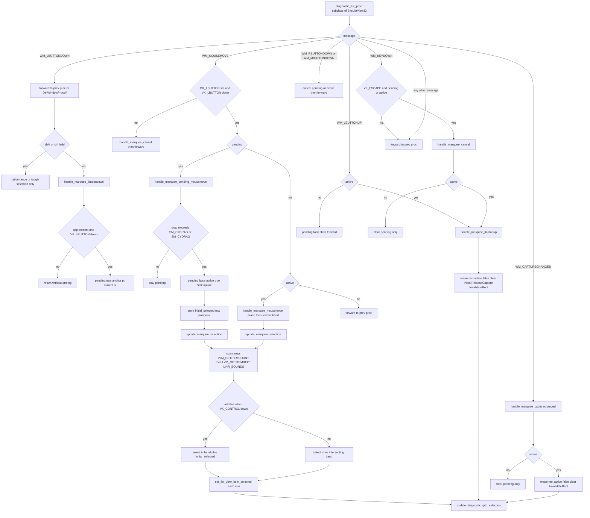

# Rubber-Band Marquee Selection in marquee.rs

Source path: `true-tick/apps/true-tick/src/ui/marquee.rs`

## Notes

- The module subclasses the native SysListView32 diagnostic list so a plain left button drag draws a focus rect band and selects every row it intersects.
- `diagnostic_list_proc` resolves the owning `App` through `app_from_list`, which reads `GWLP_USERDATA` with `GetWindowLongPtrW`.
- Every `WM_LBUTTONDOWN` is forwarded to the previous proc first so the native list can set focus and the selection anchor needed for Shift click range selection.
- The custom marquee only arms when neither Shift nor Ctrl is held, since `should_use_native_click_selection` returns true for either modifier.
- A press only arms `diagnostic_marquee_pending` when `GetKeyState(VK_LBUTTON)` reports the button still down, which filters out already released clicks.
- A pending drag becomes active only after `marquee_drag_exceeded` clears the `SM_CXDRAG` or `SM_CYDRAG` threshold, and each metric is clamped to a minimum of 1.
- Activation calls `SetCapture` and snapshots the current selection via `list_selected_item_positions` into `diagnostic_marquee_initial_selected`.
- `handle_marquee_mousemove` erases the old focus rect with `draw_marquee_rect`, moves `diagnostic_marquee_current`, then redraws the new band.
- `draw_marquee_rect` normalizes the band with `points_to_rect`, skips zero width or zero height rects, and draws with `DrawFocusRect` inside a `GetDC` and `ReleaseDC` pair.
- `update_marquee_selection` reads row counts and row bounds from `LVM_GETITEMCOUNT` and `LVM_GETITEMRECT` with `LVIR_BOUNDS`, failing rows are pushed as an empty offscreen rect.
- `marquee_selected_indices` selects rows intersecting the band and, when Ctrl is held, unions them with the initial selection so additive marquee keeps prior rows.
- Release, capture change, right or middle button press, and Escape all end the drag through the cancel or lbuttonup path, which clears state, releases capture, invalidates the list, and refreshes the grid selection.
