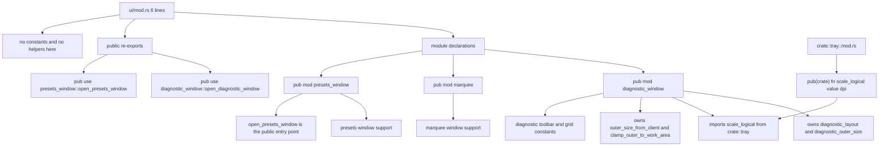

# UI Module Declarations and Window Re-exports

Source path: `true-tick/apps/true-tick/src/ui/mod.rs`

## Notes

- `ui/mod.rs` is only six lines. It declares three public submodules and adds two public re-exports, with no constants, no structs, and no functions of its own.
- The three child modules are `diagnostic_window`, `marquee`, and `presets_window`, all declared with `pub mod` so the rest of the crate can reach them.
- Only two of the three modules are surfaced through `pub use`. `open_diagnostic_window` and `open_presets_window` are re-exported, while `marquee` has no re-export at this level.
- The DPI scaling helper `scale_logical` does not live here. It is defined as `pub(crate)` in `true-tick/apps/true-tick/src/tray/mod.rs` and imported into the UI modules.
- `scale_logical(value, dpi)` multiplies the logical value by the dpi, adds 95, and integer divides by 96, with saturating math on the multiply and add so oversized inputs clamp instead of panicking.
- The outer size helper `outer_size_from_client` lives in `ui/diagnostic_window.rs` and returns a `Point` from the width and height of an adjusted frame rectangle.
- `diagnostic_outer_size` and `clamp_outer_to_work_area` in `ui/diagnostic_window.rs` build an outer size and clamp it to the work area so a window never opens larger than the usable desktop.
- Layout constants such as `DIAGNOSTIC_TOOLBAR_GAP`, `DIAGNOSTIC_TOOLBAR_MARGIN`, `DIAGNOSTIC_DEFAULT_WIDTH`, and the toolbar control widths live in `ui/diagnostic_window.rs`, not in this module file.
- The re-exports exist so callers can open a window without naming the owning submodule, keeping the call sites short.
- `marquee` is not re-exported here, so any caller of marquee support must reference `crate::ui::marquee` directly.
- This module file has no platform specific code, no Win32 imports, and no DPI logic, keeping the module graph flat and easy to audit.
- Read the sibling diagram files `ui/diagnostic_window.md`, `ui/marquee.md`, and `ui/presets_window.md` for the per module detail.
