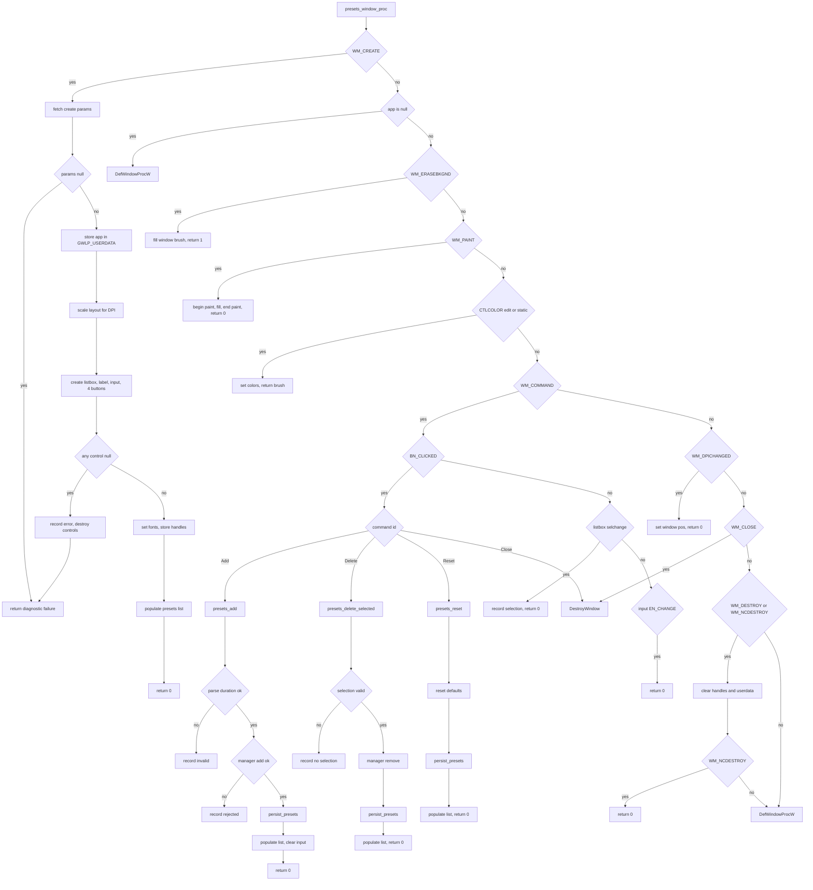

# Presets Window

Source path: `true-tick/apps/true-tick/src/ui/presets_window.rs`

## Notes

- Window class is `TrueTickPresetsClass`, sized 380 by 360, created at 140, 140 with caption, system menu, clip children and clip siblings styles.
- `open_presets_window` focuses an existing live window, restores it if iconic, and clears stale handles when `IsWindow` fails.
- Children are created in `WM_CREATE`: a listbox, a static label, an edit input, and Add, Delete, Reset, Close buttons.
- The listbox uses `LBS_NOTIFY` and `WS_VSCROLL`. The edit input uses `ES_AUTOHSCROLL` with `EM_LIMITTEXT` of 64 characters.
- Layout values are scaled per DPI with `scale_logical`, and the button row width is split into four equal columns.
- The `App` pointer is stored in `GWLP_USERDATA` during `WM_CREATE` and read at the top of every later message.
- Add reads the input text, parses it with `DurationPreset::parse`, accepts formats like 15m or 1h 30m, then adds, persists, repopulates, and clears the input.
- Delete reads the current index with `LB_GETCURSEL` and rejects the request when the selection is `LB_ERR` or negative.
- Reset restores factory defaults through `presets_manager.reset_defaults`.
- Every successful add, delete, or reset calls `persist_presets`, which saves `schedule_presets_seconds` atomically and records a failed diagnostic without changing config on error.
- Listbox selection changes record `presets.selection` with the index, and edit input changes are ignored.
- `WM_DESTROY` clears the stored handles, and `WM_NCDESTROY` clears handles and userdata and returns 0 to end the window proc.
