# tick-core src/lib.rs

Source: `true-tick/crates/tick-core/src/lib.rs`

```mermaid
flowchart TD
    A["tick-core lib.rs"]
    A --> B["Hns value type wraps u64"]
    A --> C["Lifecycle Created Running Stopping Stopped"]
    A --> D["Status Released Active Requested Warning Blocked Error Unknown Unsupported"]
    A --> E["DesiredIntent Acquire Release"]
    A --> F["DesiredIntentQueue pending Option"]
    A --> G["Event Start Stop PolicyChanged ObservationUnavailable"]
    A --> H["CoreError InvalidLifecycleTransition Unsupported ObservationFailed raw_status"]
    A --> I["Constants HNS_PER_MILLISECOND 10000"]

    B --> B1["new and value are const"]
    B --> B2["to_duration calls Duration from_nanos with saturating_mul 100"]
    B --> B3["format_milliseconds"]
    B --> B4["format_detailed"]
    B --> B5["From Duration divides as_nanos by 100 then clamps to u64 max"]
    B --> B6["Display writes value followed by HNS"]

    B3 --> W1["write_milliseconds_bytes"]
    W1 --> W2["whole equals value divided by 10000 and rem equals value minus whole times 10000"]
    W2 --> W3["Cursor write of whole and four digit rem"]
    W3 --> W4{"write succeeds"}
    W4 -- yes --> W5["len is cursor position"]
    W4 -- no --> W6["panic because 32 byte buffer always fits"]
    W5 --> W7["from_utf8_unchecked slice converted to owned String"]

    B4 --> D1["format whole and four digit rem then ms and raw HNS count"]

    F --> F1["request sets pending to Some"]
    F --> F2["take uses Option take"]
    F2 --> F3{"pending present"}
    F3 -- yes --> F4["Some intent and queue becomes None"]
    F3 -- no --> F5["None"]
    F --> F6["pending returns the stored Option"]

    H --> H1["Display matches each variant to a message"]

    A --> J["is_leap_year year"]
    J --> J1{"year divisible by 4 and not by 100"}
    J1 -- yes --> J2["true"]
    J1 -- no --> J3{"year divisible by 400"}
    J3 -- yes --> J2
    J3 -- no --> J4["false"]

    A --> K["days_in_month year month"]
    K --> K1{"month"}
    K1 -- "1 3 5 7 8 10 12" --> K2["31"]
    K1 -- "4 6 9 11" --> K3["30"]
    K1 -- "2" --> K4{"is_leap_year"}
    K4 -- yes --> K5["29"]
    K4 -- no --> K6["28"]
    K1 -- other --> K7["0"]

    A --> L["days_from_civil year month day"]
    L --> L1["clamp month to 1 through 12"]
    L1 --> L2["clamp day to 1 through days_in_month"]
    L2 --> L3{"month is 2 or less"}
    L3 -- yes --> L4["adjusted_year equals year minus 1"]
    L3 -- no --> L5["adjusted_year equals year"]
    L4 --> L6{"adjusted_year is 0 or more"}
    L5 --> L6
    L6 -- yes --> L7["era equals adjusted_year divided by 400"]
    L6 -- no --> L8["era equals adjusted_year minus 399 divided by 400"]
    L7 --> L9["Hinnant arithmetic returns days since 1970-01-01"]
    L8 --> L9

    A --> M["try_days_from_civil year month day"]
    M --> M1{"month is 1 through 12"}
    M1 -- no --> M2["None"]
    M1 -- yes --> M3{"day is under 1 or over days_in_month"}
    M3 -- yes --> M2
    M3 -- no --> M4["Some of days_from_civil result"]

    A --> N["civil_from_days days"]
    N --> N1["shifted equals days plus 719468"]
    N1 --> N2{"shifted is 0 or more"}
    N2 -- yes --> N3["era equals shifted divided by 146097"]
    N2 -- no --> N4["era equals shifted minus 146096 divided by 146097"]
    N3 --> N5["Hinnant arithmetic yields year month day"]
    N4 --> N5
    N5 --> N6{"shifted_month is under 10"}
    N6 -- yes --> N7["month equals shifted_month plus 3"]
    N6 -- no --> N8["month equals shifted_month minus 9"]
    N7 --> N9{"month is 2 or less"}
    N8 --> N9
    N9 -- yes --> N10["year is incremented by 1"]
    N9 -- no --> N11["year is unchanged"]
    N10 --> N12["return tuple year month day"]
    N11 --> N12

    A --> O["format_ymd year month day"]
    O --> O1{"year is negative"}
    O1 -- yes --> O2["minus sign then zero padded absolute year and month and day"]
    O1 -- no --> O3["zero padded year and month and day"]
```

## Notes

- The crate is platform neutral and performs no operating system calls. HNS is a pure value type.
- `Hns` derives `Clone Copy Debug Eq Ord PartialEq PartialOrd` and wraps a single private `u64`.
- `HNS_PER_MILLISECOND` is `10_000`, so one HNS is exactly one ten-thousandth of a millisecond.
- `format_milliseconds` is exact to four decimal places and applies no rounding. Division and remainder drive the digits.
- `write_milliseconds_bytes` writes through a `Cursor` and panics only if the 32 byte stack buffer would overflow, which the documented worst case cannot reach.
- `format_milliseconds` uses `from_utf8_unchecked` under a safety comment because the writer emits only ASCII digits and a period.
- `Hns::from(Duration)` truncates toward zero by integer division and clamps to `u64::MAX`.
- `DesiredIntentQueue` keeps only the latest request because `request` overwrites `pending` and `take` clears it.
- `CoreError` implements both `Display` and `std::error::Error`, with `ObservationFailed` carrying a `raw_status` value.
- `days_from_civil` clamps out-of-range months and days instead of failing, while `try_days_from_civil` rejects the same inputs with `None`.
- `civil_from_days` is the inverse of `days_from_civil` and returns one-based month and day.
- `format_ymd` renders negative years with a leading minus and a zero padded absolute value.