# tick-crypto lib

Source path: `true-tick/crates/tick-crypto/src/lib.rs`

```mermaid
flowchart TD
    subgraph KeyManagement["Key and Trust Setup"]
        KG["generate_keypair()"] -->|"OsRng secret seed and public key"| KP["(secret, public)"]
        RAW_SEC["raw secret slice"] --> SKFB["signing_key_from_bytes()"]
        SKFB -->|"length == 32"| SK["SigningKey"]
        SKFB -->|"length != 32"| ERR_WKL1["CryptoError::WrongKeyLength"]
        RAW_PUB["raw anchor slice"] --> TAFB["TrustAnchor::from_bytes()"]
        TAFB -->|"length == 32"| TA["TrustAnchor"]
        TAFB -->|"length != 32"| ERR_WKL2["CryptoError::WrongKeyLength"]
    end

    subgraph ManifestSigning["Manifest Signing Pipeline"]
        IN_ENTRIES["entries slice"] --> SM["sign_manifest()"]
        IN_COUNTER["release counter"] --> SM
        IN_SEC["secret key slice"] --> SM
        SM --> SORT_DEDUP["sort entries by path and dedup"]
        SORT_DEDUP --> CB_SIGN["canonical_bytes()"]
        CB_SIGN --> SB["sign_bytes()"]
        SB --> SKFB
        SB --> SIGN_OP["signing.sign(message)"]
        SIGN_OP --> SIG_BYTES["64-byte signature"]
        SIG_BYTES --> FORMAT_TXT["format UTF-8 text with signature hex"]
        FORMAT_TXT --> OUT_TXT["signed manifest text"]
    end

    subgraph ManifestParsing["Manifest Parsing Pipeline"]
        RAW_TEXT["manifest text string"] --> PSM["parse_signed_manifest()"]
        PSM --> LINE_LOOP["split lines and check length <= 4096"]
        LINE_LOOP -->|"line > 4096 bytes"| ERR_MM1["CryptoError::MalformedManifest"]
        LINE_LOOP --> PARSE_PREFIX{"prefix match"}
        PARSE_PREFIX -->|"release_counter value"| PARSE_RC["parse u64 counter"]
        PARSE_PREFIX -->|"entry path hex"| PARSE_ENTRY["validate unique path and decode 32-byte hex"]
        PARSE_PREFIX -->|"signature hex"| PARSE_SIG["check 128 hex chars and decode 64 bytes"]
        PARSE_PREFIX -->|"unrecognized or duplicate"| ERR_MM2["CryptoError::MalformedManifest"]
        PARSE_ENTRY -->|"exceeds 256 entries"| ERR_MM3["CryptoError::MalformedManifest"]
        PARSE_ENTRY --> DH_ENTRY["decode_hex::<32>()"]
        PARSE_SIG --> DH_SIG["decode_hex::<64>()"]
        PARSE_SIG -->|"length != 128"| ERR_WSL["CryptoError::WrongSignatureLength"]
        PARSE_RC --> BUILD_SM["assemble SignedManifest"]
        DH_ENTRY --> BUILD_SM
        DH_SIG --> BUILD_SM
    end

    subgraph CanonicalSerialization["Canonical Byte Serialization"]
        SM_OBJ["SignedManifest"] --> CANON["canonical_bytes()"]
        CANON --> SORT_PATHS["sort entries lexicographically by path"]
        SORT_PATHS --> SER_LINES["serialize release_counter and entry lines"]
        SER_LINES --> BYTE_SEQ["canonical byte sequence without signature line"]
    end

    subgraph ManifestVerification["Verification and Validation"]
        VM["verify_manifest()"] --> VERIF_KEY["VerifyingKey::from_bytes(anchor.key)"]
        VERIF_KEY -->|"invalid key bytes"| ERR_SIG_INV1["CryptoError::SignatureInvalid"]
        VM --> CANON
        VM --> SIG_VERIF["VerifyingKey::verify(canonical_bytes, signature)"]
        SIG_VERIF -->|"crypto verification fails"| ERR_SIG_INV2["CryptoError::SignatureInvalid"]
        SIG_VERIF -->|"valid signature"| OK_SIG["Ok(())"]

        VED["verify_entry_digest()"] --> FIND_PATH{"find entry by path"}
        FIND_PATH -->|"not found"| ERR_DM1["CryptoError::DigestMismatch"]
        FIND_PATH -->|"found"| SHA_CALC["Sha256::digest(target_bytes)"]
        SHA_CALC --> COMP_DIGEST{"digest == entry.sha256"}
        COMP_DIGEST -->|"match"| OK_DIGEST["Ok(())"]
        COMP_DIGEST -->|"mismatch"| ERR_DM2["CryptoError::DigestMismatch"]

        CRC["check_release_counter()"] --> COMP_COUNTER{"manifest counter > previously seen"}
        COMP_COUNTER -->|"greater"| OK_COUNTER["Ok(())"]
        COMP_COUNTER -->|"less or equal"| ERR_DOWNGRADE["CryptoError::SignatureInvalid downgrade refusal"]
    end
```

## Notes

- Generates 32 byte Ed25519 seed keys and public keys using operating system entropy via rand_core OsRng
- signing_key_from_bytes checks exact 32 byte secret seed length before building an ed25519_dalek SigningKey
- TrustAnchor holds a 32 byte public key and validates slice length in from_bytes
- Manifest entries contain package relative path string and 32 byte SHA-256 digest
- Maximum 256 entries per manifest and 4096 bytes per line are enforced during parsing
- sign_manifest clones input entries sorts them by path and deduplicates before canonical serialization
- canonical_bytes emits release_counter followed by path sorted entry lines terminating each with LF
- Manifest signature line is excluded from canonical bytes and appended in lowercase hex
- parse_signed_manifest rejects unknown line prefixes non lowercase hex whitespace in paths and duplicate paths
- verify_manifest checks Ed25519 signature over canonical bytes using the TrustAnchor verifying key
- verify_entry_digest computes SHA-256 on candidate file bytes and checks equality against manifest record
- check_release_counter rejects counters less than or equal to previously seen counter with SignatureInvalid
