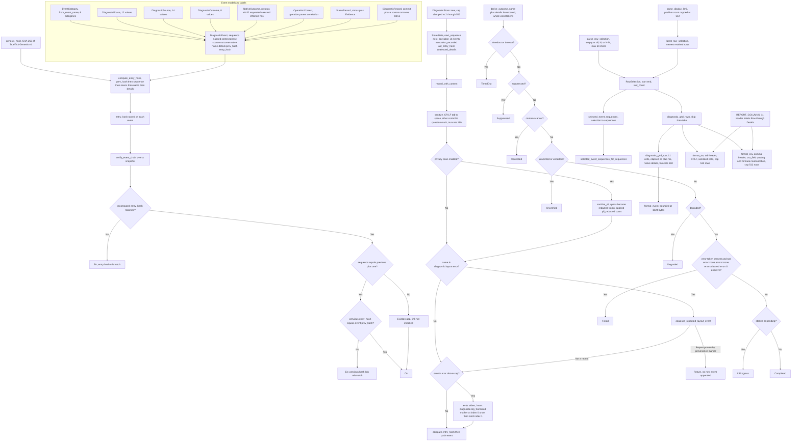

# tick-diagnostics lib architecture

Source: `crates/tick-diagnostics/src/lib.rs`

## Notes

* The store is in memory only for a single process session, it never writes files, logs to disk, or inspects machine and user state.
* `DEFAULT_MAX_EVENTS` and `HARD_MAX_EVENTS` are both 512 and `DiagnosticStore::new` clamps the requested cap into the range 2 to 512.
* `MAX_FIELD_LENGTH` is 160 bytes and `MAX_RENDERED_EVENT_BYTES` is 1024 bytes, both truncation paths stop on a valid UTF-8 boundary and append an ellipsis.
* `genesis_hash` is the SHA-256 digest of the fixed seed `TrueTick-Genesis-v1` and seeds `last_entry_hash` at store construction.
* `compute_entry_hash` hashes prev_hash, little endian sequence, little endian elapsed nanoseconds, name, and details in that fixed order.
* `verify_event_chain` recomputes every entry hash first, then checks the previous hash link only when the retained sequence numbers are adjacent, so a gap marks an expected ring buffer eviction boundary instead of tampering.
* Truncation is detected by `snapshot_is_truncated`, which checks whether the first retained event is named `diagnostic.log_truncated`, and the marker is inserted at index 0 with source Diagnostic and outcome Completed.
* `derive_outcome` uses whole word tokens so informational text such as `errors.cleared` and `error=none` stays Completed, while `cancel` is a plain substring check and call sites that know the real result use `record_with_outcome`.
* `sanitize` maps CR, LF, and tab to a space, other control characters to a question mark, and then bounds the field to 160 bytes.
* Sanitized details run through `privacy::sanitize_pii`, each detected span is replaced with the fixed redacted token, and the finding count is appended as `pii_redacted`.
* Coalescing applies only to `diagnostic.layout.error`, rewrites a `repeat_count` suffix only when the existing string matches the `coalesced_details` provenance marker, and otherwise preserves the suffix as a fresh event.
* `REPORT_COLUMNS` holds 11 columns, CSV fields are quoted and formula injection prefixes are neutralized, and both TSV and CSV output are capped at 512 rows with byte budgets derived from the column count and field length.
