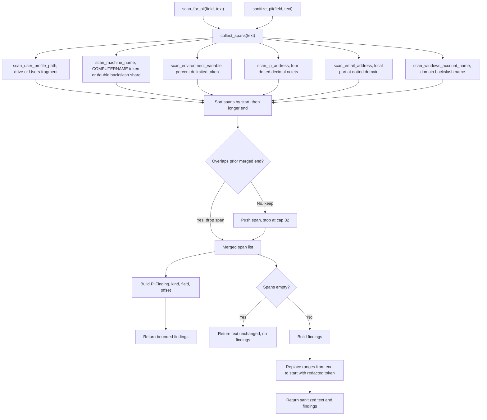

# tick-diagnostics privacy architecture

Source: `crates/tick-diagnostics/src/privacy.rs`

## Notes

* `PII_SCAN_ENABLED` defaults to true, the store claims a zero PII guarantee for recorded events
* `MAX_PII_FINDINGS` caps findings at 32 so a pathological payload cannot produce unbounded output
* Both entry points funnel through `collect_spans`, which runs six bounded heuristics over the raw bytes
* `scan_user_profile_path` detects a drive letter, colon, backslash, `Users` prefix and any bare `\Users\` fragment
* `scan_machine_name` detects the literal `COMPUTERNAME` token and a double backslash share prefix, percent wrapped forms are left to the environment scanner
* `scan_environment_variable` matches percent delimited tokens, breaking on whitespace or a span longer than 64 bytes
* `scan_ip_address` requires four octets of one to three digits and rejects spans bordered by adjacent digits or dots
* `scan_email_address` requires a nonempty local part, an at sign, and a dotted domain with no leading, trailing or doubled dots
* `scan_windows_account_name` skips candidates whose domain is `Users` or that follow a backslash or colon, so path segments are not misread as accounts
* `collect_spans` sorts by start offset then longer end first, then drops any span that begins before the prior merged end
* `scan_for_pii` returns only `kind`, `field` and byte `offset`, the field name is copied verbatim without allocation
* `sanitize_pii` replaces spans from the end toward the start so earlier offsets stay valid and outside bytes are preserved exactly
