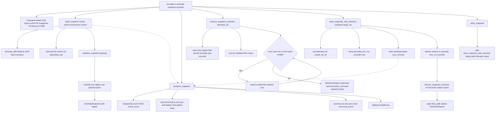

# tick-diagnostics src/recorder.rs

Source: `true-tick/crates/tick-diagnostics/src/recorder.rs`

## Notes

* A snapshot holds a FailureVector, a bounded detail String, an EnvironmentSnapshot and the last 64 DiagnosticEvent values
* EnvironmentSnapshot is a fixed set of u32 and u64 counters set to zero when the platform cannot collect a field
* build_snapshot truncates detail at a UTF-8 boundary so it never exceeds 1024 bytes
* Recent events are capped by slicing with saturating_sub so an empty source keeps an empty list
* The digest is lowercase hex SHA-256 over the fully serialized payload
* serialize_snapshot writes one key per line in a deterministic order with header, environment, events and digest blocks
* Retention only considers regular files directly inside telemetry_dir named anomaly star recorder, it never recurses and never touches directories
* Candidates are sorted by modification time ascending with the name as a deterministic tiebreak
* While count exceeds 16 or total bytes exceed 8 MiB the oldest file is removed and its size is subtracted
* write_snapshot_with_retention writes to a tmp file, syncs it to disk, drops the handle and then renames it atomically
* A retention failure is reported as None and does not remove or invalidate the freshly written snapshot
* write_snapshot wraps the same write and retention flow and returns only the final snapshot path
