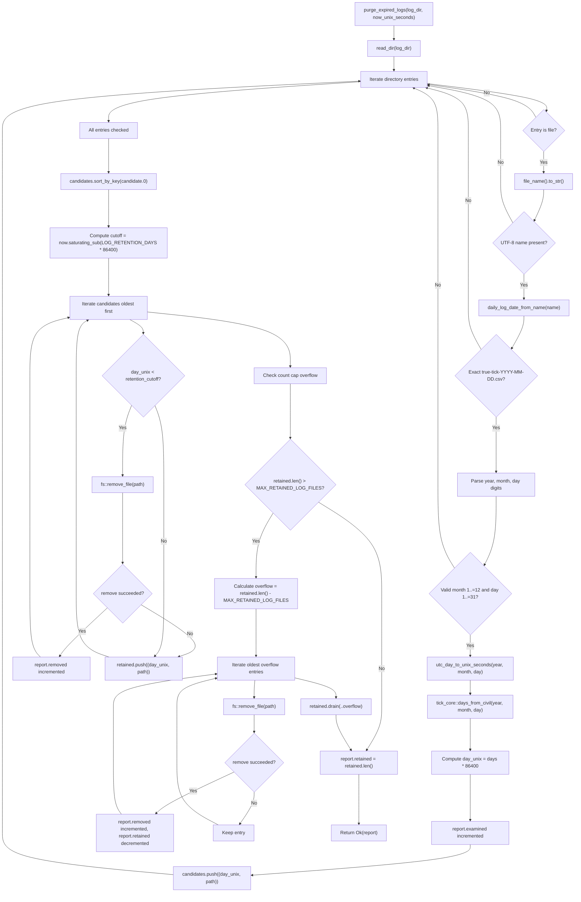

# tick-diagnostics retention architecture

Source: `crates/tick-diagnostics/src/retention.rs`

## Notes

* Source file lives at `crates/tick-diagnostics/src/retention.rs`
* `LOG_RETENTION_DAYS` is set to 30 days evaluated at 00:00:00 UTC granularity
* `MAX_RETAINED_LOG_FILES` is set to 64 files to enforce an upper bound count cap
* `daily_log_date_from_name` strictly matches pattern `true-tick-YYYY-MM-DD.csv` and rejects all deviations
* Non-matching file names, invalid date digits, or month and day out of range are skipped without incrementing examined count
* `utc_day_to_unix_seconds` converts civil year, month, and day into days via `tick_core::days_from_civil`
* Daily timestamp in seconds is obtained by multiplying civil days by 86400
* Candidates are sorted chronologically by timestamp so older log files are evaluated and purged first
* First purge pass deletes files whose daily timestamp is strictly older than the calculated retention cutoff
* Any file that fails deletion during the retention pass is preserved in the retained vector
* Second purge pass enforces the file count cap by removing the oldest overflow files beyond 64
* Returns `LogRetentionReport` tracking examined candidate files, removed files count, and final retained count
