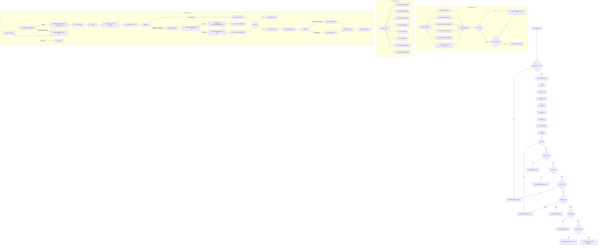

# tick-ipc lib architecture

Source: `crates/tick-ipc/src/lib.rs`

## Notes

* Frame header is 44 bytes so the smallest legal frame is 48 bytes with an empty payload plus the 4 byte CRC trailer.
* Payload length is capped at 256 bytes in both IpcFrame::new and deserialize, and an over long payload is code 3.
* CRC is standard CRC-32 with polynomial 0xEDB88320 and covers every header and payload byte before the little endian trailer.
* Decoding demands the exact total length, so short input is code 4 and extra input is code 15.
* Magic is TTIP, version is 1, and verbs map only 1 through 5, with violations reported as code 1, code 2 or code 5.
* Session tokens are 32 bytes, compared in constant time, and the Debug impl redacts the bytes instead of printing them.
* Token hex form is exactly 64 lowercase characters, so uppercase input and wrong lengths are rejected as code 10.
* Error codes are stable 1 through 16 and from_code_param returns None above 16, while secondary fields such as calculated come back zeroed.
* Interval validation accepts 5000 HNS or the inclusive 5000 to 156250 HNS band, anything else is code 6.
* Response tags run 1 through 6, only tag 1 takes variable length bytes, tags 3 and 5 require empty payloads, and tag 6 encodes code then wire_param, decoded via from_code_param.
* The client opens the pipe with FILE_FLAG_OVERLAPPED, so the write and the read each use a real OVERLAPPED with an event and every pended operation waits at most 5000 ms.
* On timeout the client cancels the I/O, drains the cancellation through GetOverlappedResult, then closes the event, and the rate limiter allows 10 requests per second per PID over at most 64 tracked PIDs.