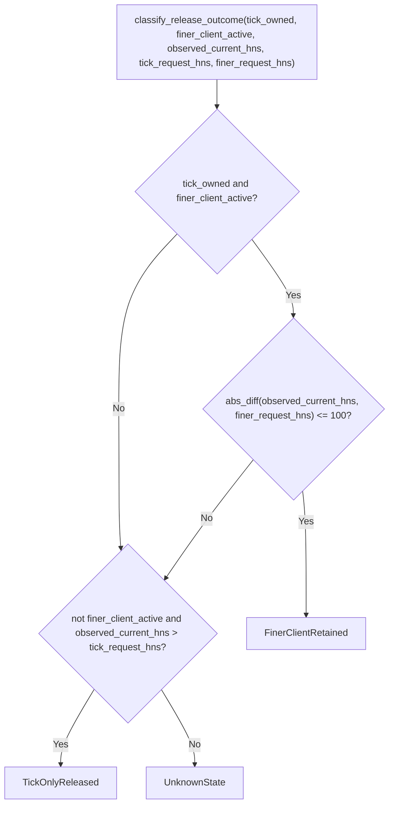

# tick-multiclient lib architecture

Source: `crates/tick-multiclient/src/lib.rs`

## Notes

* Crate is a multi-client ownership test harness proving True Tick releases only its own tracked timer contribution
* `ClientRole` distinguishes a helper request that is `Finer` or `Coarser` than the tick request
* `ClientSpec` pairs a `ClientRole` with the helper interval in 100-nanosecond units
* `ReleaseOutcome` is the classification: `TickOnlyReleased`, `FinerClientRetained`, or `UnknownState`
* `FinerClientRetained` requires tick ownership plus an active finer client
* Finer retention is confirmed when the observed current value is within 100 HNS of the finer request
* The 100 HNS tolerance mirrors the hardware timer tolerance so crystal quantization jitter is not misclassified
* `TickOnlyReleased` requires no active finer client and an observed current value strictly coarser than the tick request
* Any observation that satisfies neither branch falls through to `UnknownState`
* `expect_after_release` is a separate pure expectation helper returning `finer_held`, `released`, or `uncertain`
* Classification is intentionally coarse and does not model every scheduling detail
* Three unit tests cover finer retention, tick-only release, and the unknown-state fallthrough
