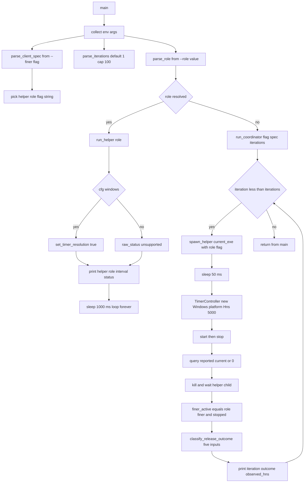

# tick-multiclient main

Source path: `true-tick/crates/tick-multiclient/src/main.rs`

## Notes

- Binary is the coordinator and helper for the multi-client ownership harness, sharing one entry point for both modes.
- `main` collects `env::args`, then parses role, iterations, and client spec before branching.
- Role helper mode triggers when `--role` is followed by `finer` or `coarser`. Any other value leaves role `None`.
- Without a valid role the process runs as coordinator, which spawns a copy of itself as a helper.
- `parse_iterations` reads `--iterations`, defaults to 1, and clamps at `MAX_ITERATIONS` of 100.
- `parse_client_spec` selects `ClientRole::Finer` only when `--finer` is present, otherwise coarser, with interval 5000 or 10000 hns.
- Constant `TICK_REQUEST_HNS` is 5000 and drives every coordinator `TimerController`.
- Coordinator loop spawns a helper from `env::current_exe` with null stdout and stderr, waits 50 ms, then starts and stops the timer controller.
- Observed hns comes from `controller.query().reported_current.value()`, falling back to 0 on error.
- Helper child is killed and reaped before classification on each iteration.
- `classify_release_outcome` labels results as `tick_only_released`, `finer_client_retained`, or `unknown_state`.
- No explicit exit code path exists. Helper mode loops forever, coordinator returns normally so the process exits 0 unless a panic occurs.