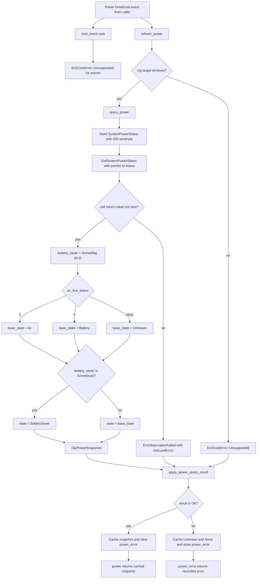

# tick-observation-windows (lib)

Source: `true-tick/crates/tick-observation-windows/src/lib.rs`

## Notes

- The adapter is event driven, doing no polling and no background timers, so a refresh only happens when the caller asks.
- `PowerSnapshot` holds a `PowerState` plus an optional `battery_saver` flag, and it is `Clone`, `Copy`, `Debug`, `Eq`, and `PartialEq`.
- `ObservationSource` declares `next_event`, `power`, and `refresh_power`, while `next_event` stays a stub returning `CoreError::Unsupported`.
- `WindowsObservation::default` starts at `PowerState::Unknown` with `battery_saver` set to `None` and no recorded error.
- `refresh_power` compiles to `query_power` under `cfg(windows)` and returns `CoreError::Unsupported` on every other target.
- `query_power` calls `GetSystemPowerStatus` through a raw `extern "system"` binding in `kernel32`.
- The `SystemPowerStatus` struct is pre-seeded with 255 sentinel values so an unfilled field reads as unknown rather than as a real reading.
- A zero return from the call becomes `CoreError::ObservationFailed` carrying the raw value from `GetLastError`.
- `ac_line_status` maps 1 to `Ac`, 0 to `Battery`, and any other value to `Unknown`.
- The battery saver flag is read only from bit 0 of `system_status_flag` and, when true, overrides the base state with `PowerState::BatterySaver`.
- `apply_power_query_result` fails closed, clearing the cached snapshot to `Unknown` and `None` and storing the error before returning it.
- A successful result replaces the cached snapshot and clears any earlier `power_error`, and the tests cover stale power clearing, error clearing, and the non-windows unsupported path.
